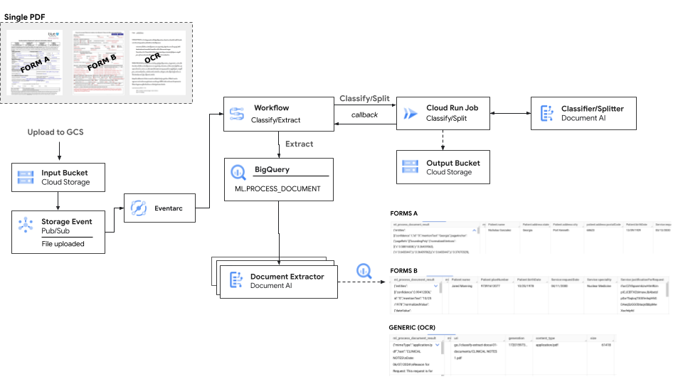
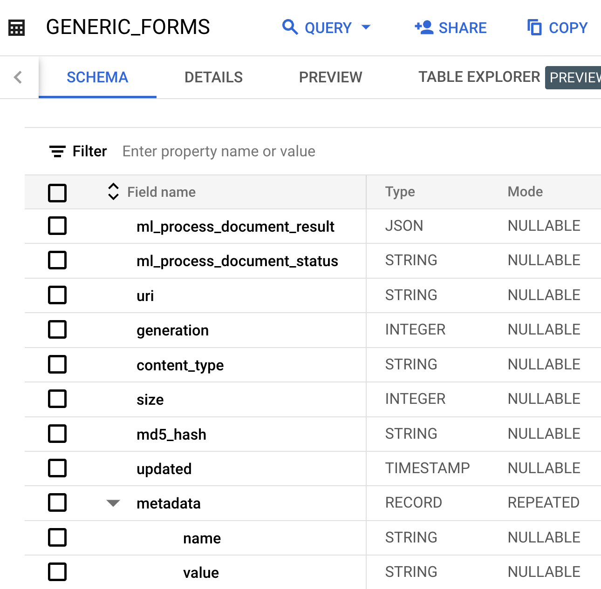
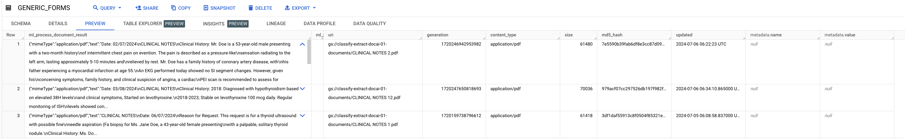
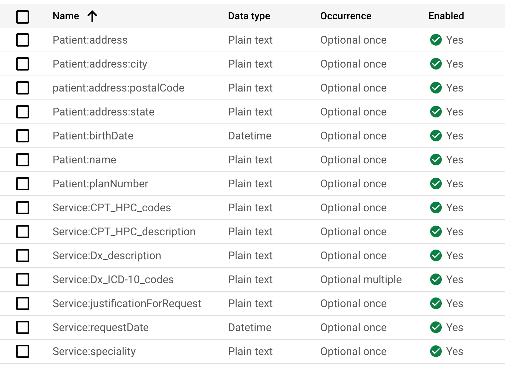
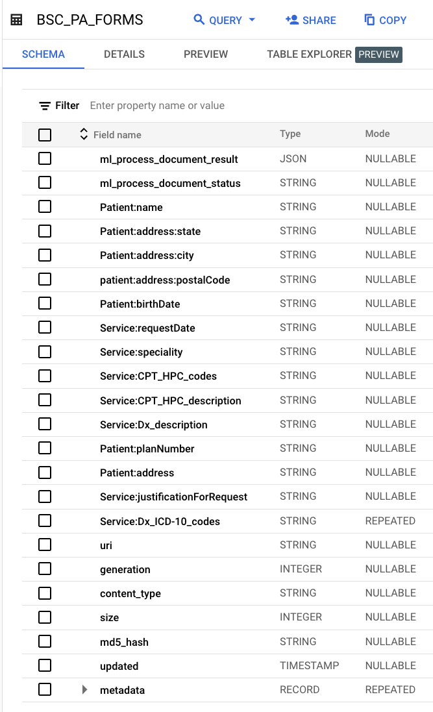

# Document AI End-To-End Solution for Classification/Splitting/Extraction

<!-- TOC -->
* [Document AI End-To-End Solution for Classification/Splitting/Extraction](#document-ai-end-to-end-solution-for-classificationsplittingextraction)
  * [Introduction](#introduction)
  * [Architecture](#architecture)
    * [Pipeline Steps](#pipeline-steps)
    * [Google Cloud Products Used](#google-cloud-products-used)
    * [Quotas](#quotas)
    * [Big Query Tables](#big-query-tables)
      * [Form/OCR Parser](#formocr-parser)
    * [Specialized Processors](#specialized-processors)
      * [Custom Document Extractor](#custom-document-extractor)
  * [Setup](#setup)
    * [Preparation](#preparation)
    * [Dependencies](#dependencies)
    * [Deployment](#deployment)
      * [Setup](#setup-1)
      * [Processors](#processors)
      * [BigQuery Reservations](#bigquery-reservations)
    * [Configuration](#configuration)
  * [Running the Pipeline](#running-the-pipeline)
    * [Out-of-the box demo](#out-of-the-box-demo)
    * [Using DATA_SYNCH](#using-datasynch)
    * [Running the Batch](#running-the-batch)
  * [Next Steps](#next-steps)
  * [References](#references)
    * [Similar Demos](#similar-demos)
<!-- TOC -->

## Introduction
This solution aims to streamline document Classification/Splitting and Extracting with all data being saved to the BigQuery using.
The user can simply plugin their own custom maid Classifier/Splitter/Extractor by changing the configuration file (and can even do it real-time, since the file is stored in GCS) and specify output BigQuery table for each processor.

For an example use case, the application is equipped to process an individual US Tax Return using the Lending Document AI Processors (out-of-the box Specialized processors). 
However you absolutely can and should train your own custom Splitter/Classifier and Extractor. Then you can specify fields (labels) to be extracted and saved to bigQuery in the format you need.

> NOTE: LDAI Splitter & Classifier in this Demo require allowlisting to use.  
> [Read More about Lending DocAI](https://cloud.google.com/solutions/lending-doc-ai)

## Architecture



### Pipeline Steps

All environment variables referred further on are defined in the [vars.sh](vars.sh) file.

1) Pipeline execution is triggered by uploading document into the GCS bucket.
   - Note, there is a dedicated bucket assigned to send Pub/Sub notifications: `CLASSIFY_INPUT_BUCKET`
   - If `DATA_SYNC` environment variable  is set to _true_, then any PDF document will trigger pipeline as long as it is uploaded inside the `CLASSIFY_INPUT_BUCKET`.
   - Otherwise only `START_PIPELINE` file will trigger BATCh processing (of all the documents inside the uploaded folder).
   - Do not upload files into the `splitter_output` sub-folder - it is the `system` directory to store the split sub-documents and therefore is ignored.
2) Pub/Sub enet is forwarded to the  [GCP Workflow execution](https://console.cloud.google.com/workflows/workflow/us-central1/classify-extract/).
3) Workflow checks the file uploaded and triggers Cloud Run Job for the Document Classification and Splitting.
4) [Classification Cloud Run Job](https://console.cloud.google.com/run/jobs/details/us-central1/classify-job):
  - Uses Document AI Classifier or Splitter as it is defined in the [config.json](classify-job/config/config.son) file (`parser_config`/`classifier`).
  - For each document sent for the processing, determines `confidence` and `type` (Classifier), determines page boundaries and type of each page (Splitter) and does the splitting into the `splitter_output` sub-folder.  
  - File `config.json` defines the relation between Classifier labels and Document Parsers to be used for those label (as well as the output BigQuery table for each model).
  - Creates a _json_ file inside `CLASSIFY_OUTPUT_BUCKET` bucket that is the result of the classification/splitting job and is used for the Extraction.
    - The path to this json file is sent back to the GCP Workflow in the callback when Classification job is completed.
    - Here is an example of the output json file:
    
```text
[
    ...
    {
        "object_table_name": "classify-extract-docai-01.mlops.GENERIC_FORM_DOCUMENTS_20240713_071014814006",
        "model_name": "classify-extract-docai-01.mlops.OCR_PARSER_MODEL",
        "out_table_name": "classify-extract-docai-01.processed_documents.GENERIC_FORMS"
    },
    {
        "object_table_name": "classify-extract-docai-01.mlops.MISC1099_FORM_DOCUMENTS_20240713_071014814006",
        "model_name": "classify-extract-docai-01.mlops.MISC1099_PARSER_MODEL",
        "out_table_name": "classify-extract-docai-01.processed_documents.MISC1099"
    },
    ...
]
```
  -  _object_table_name_ - contains all the documents that were classified/split and ended up having the same document type. 
  - _model_name_ - corresponds to the Document AI Extractor MODEL
  - _out_table_name_ - is the output BigQuery table name to be used for the extraction

  - It also creates the BigQuery mlops tables required for the [ML.PROCESS_DOCUMENT](https://cloud.google.com/bigquery/docs/reference/standard-sql/bigqueryml-syntax-process-document) function such as:
    - [Object tables](https://cloud.google.com/bigquery/docs/object-tables) for the GCS documents
    - MODEL for the Document AI parsers
  - And it assigns GCS [custom metadata](https://cloud.google.com/storage/docs/metadata#custom-metadata) to the input documents with values of classification result (`confidence` score and document `type`).
    - These metadata is then also saved along into the BigQuery. 
    - Documents that were result of splitting, have metadata pointing to the original document.
5) Entity Extraction is done by  [ML.PROCESS_DOCUMENT function](https://cloud.google.com/bigquery/docs/reference/standard-sql/bigqueryml-syntax-process-document) as the GCP Workflow next step and saved into the BigQuery.
   - Uses `json` file created by the Classifier to run the Extraction.
6) (Optional _Future_) Extracted data can be sent downstream to a 3rd party as an API call for the further integration as the final step of the Workflow Execution


### Google Cloud Products Used

- [Document AI Processors][1]
  - `LDAI Splitter & Classifier`
  - `W-2 Parser`
  - `1099 Parser(s)`
- [BigQuery][2] 
- [Cloud Run Job][3]
- [Workflows][4]

[1]: https://cloud.google.com/document-ai/docs/processors-list#lending_processors
[2]: https://cloud.google.com/bigquery
[3]: https://cloud.google.com/run
[4]: https://cloud.google.com/workflows


### Quotas
Default Quotas to be aware of:
- Number of concurrent batch prediction requests - 10
- Number of concurrent batch prediction requests processed using document processor (Single Region) per region - 5

### Big Query Tables
The BigQuery Table schema is determined in the runtime based on the DocumentAI parser used. 

- For the Generic Form parser and OCR parser the schema does not contain any specific fields labels (only the extracted json and metadata). So it is flexible on the usage and all core information is within the json field: `ml_process_document_result`.
  - Therefore you can easily export data from both OCR and FORM parser into the same BigQuery table. 
- For the Specialized Document parsers (like W-2 Parser) fields are predefined for you.
- For the user defined Custom Document Extractor the schema corresponds to the labels defined by the user and  is fixed once the table is created  (thus if you need to make changes to the Extractor, you will need to either start using a new table or manually fix the schema).
  - In order to use same BigQuery table for different Custom Document Extractors, they must use the same schema (and data types being extracted).


#### Form/OCR Parser
Form/OCR Parser Big Query Table Schema:



Sample Extracted Data using Form/OCR parser:



### Specialized Processors


Corresponding Big Query Table Schema extracted:

- TODO

Sample of the extracted data:

- TODO

#### Custom Document Extractor
User-defined Labels in the DocumentAI console:



Corresponding Big Query Table Schema extracted:




## Setup

### Preparation
The goal is to be able to re-direct in the real time each document to the appropriate Document Extractor.  

As a preparation, the user needs to: 
- Define which document types are expected and which document extractors are needed. 
- Train a classifier or splitter, that would be able to predict document class (and optionally identify document boundaries).
- Deploy (and possibly train) required document extractors.

### Dependencies

1. [Install Python](https://www.python.org/downloads/)
2. Install the [Google Cloud SDK](https://cloud.google.com/sdk/docs/install)
3. Run `gcloud init`, create a new project, and
   [enable billing](https://cloud.google.com/billing/docs/how-to/modify-project#enable_billing_for_a_project)
4. Setup application default authentication, run:
  - `gcloud auth application-default login`

### Deployment

#### Setup
* Create new GCP Project
```shell
export PROJECT_ID=..
export DOCAI_PROJECT_ID=...
gcloud config set project $PROJECT_ID
```

* If you want to make use of the existing Document AI processors in another project for example, set env variable for the Project where processors are located. Otherwise skip this step.
* This is needed to setup proper access rights.
```shell
export DOCAI_PROJECT_ID=...
```

* Run infrastructure setup script using newly created Project:
```shell
./setup.sh
```

#### Processors
* If you do not have any specific documents and do not want to do Document Training, you can make use of the ready-to-use specialized processors:
  - `LDAI Splitter & Classifier` - requires allowlisting (usually takes one business day)
  - `W-2 Parser`
  - `1099 Parser(s)`

Following script will generate following Document AI processors and update [config.json](classify-job/config/config.son) file for you.
- [OCR_PROCESSOR](https://cloud.google.com/document-ai/docs/processors-list#processor_doc-ocr)
- LENDING_DOCUMENT_SPLIT_PROCESSOR
- [FORM_W2_PROCESSOR](https://cloud.google.com/document-ai/docs/processors-list#processor_w2-parser)
- FORM_1099MISC_PROCESSOR
- FORM_1099INT_PROCESSOR

```shell
./create_demo_rpocessors.sh
```


#### BigQuery Reservations
* Create BigQuery Reservations:
  Before working with ML.PROCESS_DOCUMENT, you’ll need to turn on BigQuery Editions using the Reservations functionality.
  You’ll need BigQuery Enterprise with the minimum number of reservable slots (100) and no baseline.
  This is done through *BigQuery > Administration > Capacity management*:
  * Create Reservation 
  * Make sure to assign QUERY actions to this reservation: Click on the newly created reservation -> ASSIGNMENTS -> CREATE ASSIGNMENT of type QUERY inside your project

### Configuration

Here is the explanation of the structure of the [config.json](classify-job/config/config.son) that defines agents being used in the pipeline:

`parser_config`:
- Contains a list of the arbitrary number of the document extractors and a single classifier:
  - The document extractors:
    - can be of general purpose, ready to use out-of-the-box processors  such [OCR Parser](https://cloud.google.com/document-ai/docs/processors-list#processor_doc-ocr) or [Form Parser](https://cloud.google.com/document-ai/docs/form-parser));
    - can be a specialized extractors for domain-specific documents, such as [Invoice Parser](https://cloud.google.com/document-ai/docs/processors-list#processor_invoice-processor), [Utility Parser ](https://cloud.google.com/document-ai/docs/processors-list#processor_utility-parser)  and others
    - and a trainable [Custom Extractor](https://cloud.google.com/document-ai/docs/custom-extractor-overview)
  - The document [Classifier](https://cloud.google.com/document-ai/docs/custom-classifier)/[Splitter](https://cloud.google.com/document-ai/docs/custom-splitter):
    - Depending on the needs you should train either a Classifier or a Splitter.
      - Classifier identifies classes of documents from a user-defined set of classes and returns classification label along with the confidence score.
      - Splitter predicts the pages that make up various documents within the composite file and the class of each identified document.
    - The named is reserved and has to be `classifier` in the `config.json`.
- Each processor is described by a dictionary, with the  name that will be used in the later `document_types_config` as the key and following fields:
  - `processor_id` - full path to the processor, 
  - `out_table_name` - name of the output BigQuery table to which data is saved.

`document_types_config`:
- Contains a list of the supported document classes. Each class (or type)  is described as a dictionary with following fields:
  - `classifier_label` - the classification label as trained by the Classifier/Splitter
  - `parser` - name of document processor to be used for extracting the data.

`settings_config`:
- Right now you can specify the classification confidence threshold (`classification_confidence_threshold`) and the default document type to be returned by the Classification Job (`classification_default_class`) in case when Classifier is not defined or when returned classification falls behind the confidence threshold.
- The classification_default_class


* Modify [config.json](classify-job/config/config.son) file to match your needs or leave it as is for the demo with taxes.
* Copy file to GCS:
  ```shell
  source vars.sh
  gsutil cp classify-job/config/config.json gs://$CONFIG_BUCKET/
  ```


## Running the Pipeline

### Out-of-the box demo

If you followed the steps of LDAI Splitter & Classifier you can try the single document with taxes:

```shell
  source vars.sh
  gsutil cp sample-docs/taxes-combined.pdf gs://$CLASSIFY_INPUT_BUCKET/
```

* Go the [Workflows](https://console.cloud.google.com/workflows/workflow/us-central1/classify-extract/) and check the execution status

* Go to the [Cloud Run jobs](https://console.cloud.google.com/run/jobs/details/us-central1/classify-job) and check the Job was triggered by the Workflow

* When Job is completed, workflow will continue with extraction

* Check the [BigQuery](https://console.cloud.google.com/bigquery) `processed_documents` dataset. It should have four tables created and filled with the extracted data:
  * W2
  * GENERIC_FORMS (Because we have not created Processor for NEC for type)
  * MISC1099
  * INT1099
  
### Using DATA_SYNCH

The data synch is disabled/enabled with environment variable `DATA_SYNCH` defined in [vars.sh](vars.sh)
- When `DATA_SYNCH` is on, each document uploaded to the input bucket (`CLASSIFY_INPUT_BUCKET`), will trigger the pipeline execution.
- When `DATA_SYNCH` is off, only uploading file named `START_PIPELINE` will trigger the pipeline execution and all files in that directory will be processed (Batch mode).

To trigger single document processing:

- Modify [vars.sh](vars.sh) and set `DATA_SYNCH` to `true`
- Redeploy:
```shell
./deploy.sh
```
- Upload pdf document into the `CLASSIFY_INPUT_BUCKET` bucket (defined in [vars.sh](vars.sh))

Be mindful fo quotas (5 concurrent API requests). Therefore when you upload more than five times, this would trigger separate Pub/Sub events for each file and you will easily reach the quota limit.


### Running the Batch
In order to trigger the batch document processing, upload [START_PIPELINE](START_PIPELINE) (empty) file into the configured trigger input bucket `CLASSIFY_INPUT_BUCKET`.
All .pdf files in that folder will be processed.

```shell
source vars.sh
gsutil cp START_PIPELINE gs://"$CLASSIFY_INPUT_BUCKET"/
```

## Next Steps
- Offer an out-of-the box demo using Specialized Classifier/Extractor and OCR/FORMs parser
- Dealing with DocAI Quotas (5 concurrent jobs to classifier/docai processor). 
  - `ML.PROCESS_DOCUMENTS` fails when the volume of API calls to the remote endpoint exceeds the quota limits for that service. This issue occurs most often when you are running multiple parallel batch queries. (Limit is 5) ->
    To iterate through inference calls until all rows are successfully processed, you can use the [BigQuery remote inference SQL scripts](https://github.com/GoogleCloudPlatform/bigquery-ml-utils/tree/master/sql_scripts/remote_inference) or the [BigQuery remote inference pipeline Dataform package](https://github.com/dataform-co/dataform-bqml).
  - Classification Job:
    - Limit amount of Cloud Run Jobs that can run concurrently using Cloud task Connector in Workflows. Example of [workflow execution with Cloud task queue](https://github.com/GoogleCloudPlatform/workflows-demos/tree/master/workflow-tasks-workflow)
- Dealing with ML Limitations - The function can't process documents with more than 15 pages. Any row that contains such a file returns an error. 
  - Split document for more than 15 pages and support retrieving of data across split documents.
- Add functionality to support document splitting using Splitter:
  - Use [GCS custom metadata](https://cloud.google.com/storage/docs/metadata#custom-metadata) to provide additional information/context along with the data into the BigQuery (such as original file that was split).
- Convert setup bash scripts to terraform
  - [Terraform with imported YAML](https://github.com/GoogleCloudPlatform/workflows-demos/tree/master/terraform/import-yaml)
- Use confidence threshold to mark document for Human Review before proceeding with Extraction. 
- Use confidence score of the extracted data to mark document for Human Review. 
- Add support for other MIME/TYPES, such as jpeg, png, etc (Currently only PDF documents are supported)
- Use [GCS custom metadata](https://cloud.google.com/storage/docs/metadata#custom-metadata) to provide additional information/context along with the data into the BigQuery.
  - Could be used for example to store information about classification/splitting job.
  - To store classification/splitting job output
- Add UI + Firebase for HITL and Access to the data 
- Fix logging handler for CLoud Run Job (requires more setup to set proper levels)


## References
- [GCP Workflows demoes](https://github.com/GoogleCloudPlatform/workflows-demos?tab=readme-ov-file)
- [Workflow Syntax](https://cloud.google.com/workflows/docs/reference/stdlib)
- [Document AI Overview](https://cloud.google.com/document-ai/docs/overview)
  - [Send a processing request](https://cloud.google.com/document-ai/docs/send-request)

### Similar Demos
- [Smart expenses demo](https://github.com/GoogleCloudPlatform/smart-expenses)
- [Tax processing Pipeline](https://github.com/GoogleCloudPlatform/document-ai-samples/tree/main/tax-processing-pipeline-python)

-----

> Copyright 2024 Google LLC
> Author: Eva Khmelinskaya