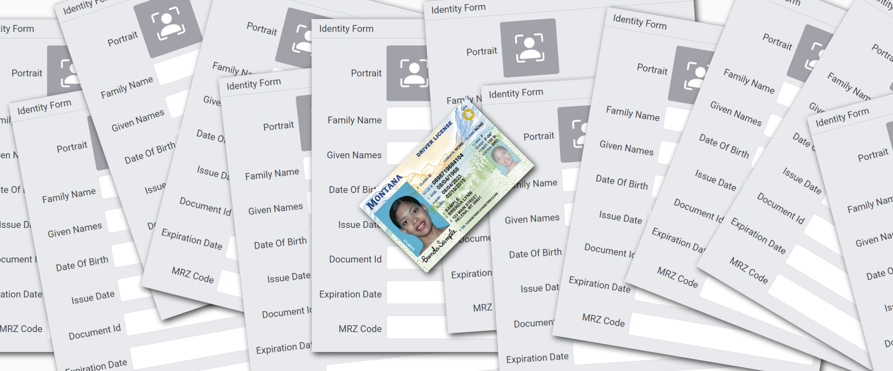
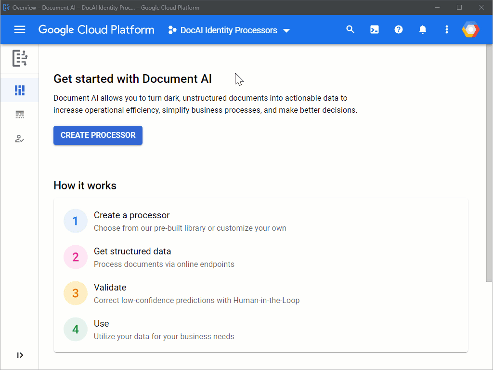
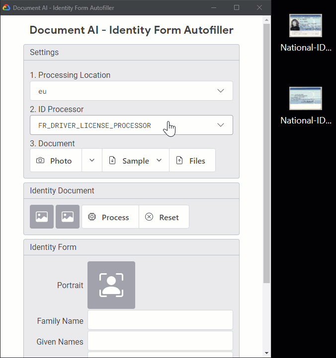
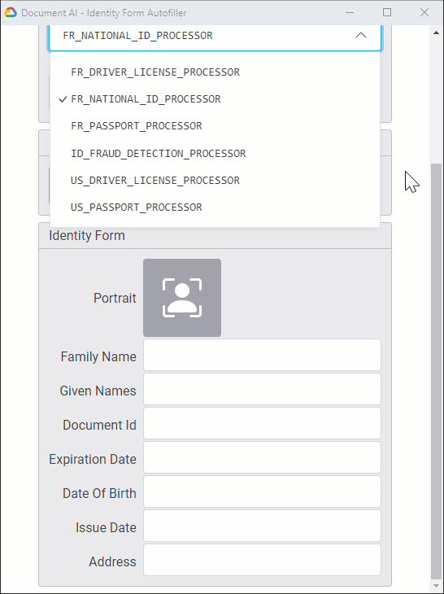

# How to automate identity document processing with Document AI



How many times have you filled out forms requesting personal information? It's probably too many times to count. When online and signed in, you can save a lot of time thanks to your browser’s autofill feature. In other cases, you often have to provide the same data manually, again and again. The first Document AI identity processors are now generally available and can help you solve this problem.

In this post, you’ll see how to…

- Process identity documents with Document AI
- Create your own identity form autofiller

## Use cases

Here are a few situations that you've probably encountered:

- **Financial accounts**: Companies need to validate the identity of individuals. When creating a customer account, you need to present a government-issued ID for manual validation.
- **Transportation networks**: To handle subscriptions, operators often manage fleets of custom identity-like cards. These cards are used for in-person validation, and they require an ID photo.
- **Identity gates**: When crossing a border (or even when flying domestically), you need to pass an identity check. The main gates have streamlined processes and are generally well equipped to scale with the traffic. On the contrary, smaller gates along borders can have manual processes – sometimes on the way in and the way out – which can lead to long lines and delays.
- **Hotels**: When traveling abroad and checking in, you often need to show your passport for a scan. Sometimes, you also need to fill out a longer paper form and write down the same data.
- **Customer benefits**: For benefit certificates or loyalty cards, you generally have to provide personal info, which can include a portrait photo.

In these examples, the requested info – including the portrait photo – is already on your identity document. Moreover, an official authority has already validated it. Checking or retrieving the data directly from this source of truth would not only make processes faster and more effective, but also remove a lot of friction for end users.

## Identity processors

### Processor types

Each Document AI identity processor is a machine learning model trained to extract information from a standard ID document such as:

- Driver license
- National ID
- Passport


Note: an ID can have information on both sides, so identity processors support up to two pages per document.

### Availability

| Processor                         | API `type`                    | Availability        |
| --------------------------------- | ----------------------------- | ------------------- |
| US Driver License Parser          | `US_DRIVER_LICENSE_PROCESSOR` | Generally Available |
| US Passport Parser                | `US_PASSPORT_PROCESSOR`       | Generally Available |
| Identity Document Proofing Parser | `ID_PROOFING_PROCESSOR`       | Public Preview      |
| France Driver License Parser      | `FR_DRIVER_LICENSE_PROCESSOR` | Limited Preview     |
| France National ID Parser         | `FR_NATIONAL_ID_PROCESSOR`    | Limited Preview     |
| France Passport Parser            | `FR_PASSPORT_PROCESSOR`       | Limited Preview     |
| AU Driver License Parser          | `AU_DRIVER_LICENSE_PROCESSOR` | Early Access        |
| Germany Driver License Parser     | `DE_DRIVER_LICENSE_PROCESSOR` | Early Access        |
| Germany Passport Parser           | `DE_PASSPORT_PROCESSOR`       | Early Access        |
| India Driver License Parser       | `IN_DRIVER_LICENSE_PROCESSOR` | Early Access        |
| India Passport Parser             | `IN_PASSPORT_PROCESSOR`       | Early Access        |
| India Pan Card Parser             | `IN_TAX_CARD_PROCESSOR`       | Early Access        |
| India Voter ID Parser             | `IN_VOTER_ID_PROCESSOR`       | Early Access        |
| India Aadhar Card Parser          | `IN_AADHAR_CARD_PROCESSOR`    | Early Access        |

Notes:

- More identity processors are in the pipe.
- To request access to processors in Preview, please fill out the [Access Request Form](https://docs.google.com/forms/d/e/1FAIpQLSc_6s8jsHLZWWE0aSX0bdmk24XDoPiE_oq5enDApLcp1VKJ-Q/viewform).

### Processor creation

You can create a processor:

- **Manually** from Cloud Console (web admin UI)
- **Programmatically** with the API

Processors are location-based. This helps guarantee where processing will occur for each processor.

Here are the current multi-region locations:

| Location       | API `location` |
| -------------- | -------------- |
| United States  | `us`           |
| European Union | `eu`           |

Once you've created a processor, you reference it with its ID (`PROCESSOR_ID` hereafter).



Note: To manage processors programmatically, see the codelab [Managing Document AI processors with Python](https://codelabs.developers.google.com/codelabs/cloud-documentai-manage-processors-python).

## Document processing

You can process documents in two ways:

- Synchronously with an **online request**, to analyze a single document and directly use the results
- Asynchronously with a **batch request**, to launch a batch processing operation on multiple or larger documents

### Online requests

Example of a REST online request:

- The method is named `process`.
- The input document here is a PNG image (base64 encoded).
- This request is processed in the European Union.
- The response is returned synchronously.

```txt
POST https://eu-documentai.googleapis.com
     /v1/projects/PROJECT_ID/locations/eu/processors/PROCESSOR_ID
     :process
```

```json
{
  "rawDocument": {
    "content": "iVBORw0KGg…",
    "mimeType": "image/png"
  },
  "skipHumanReview": true
}
```

### Batch requests

Example of a REST batch request:

- The method is named `batchProcess`.
- The `batchProcess` method launches the batch processing of multiple documents.
- This request is processed in the United States.
- The response is returned asynchronously; output files will be stored under `my-storage-bucket/output/`.

```txt
POST https://us-documentai.googleapis.com
     /v1/projects/PROJECT_ID/locations/us/processors/PROCESSOR_ID
     :batchProcess
```

```json
{
  "inputDocuments": {
    "gcsDocuments": {
      "documents": [
        {
          "gcsUri": "gs://my-storage-bucket/input/id-doc-1.pdf",
          "mimeType": "application/pdf"
        },
        {
          "gcsUri": "gs://my-storage-bucket/input/id-doc-2.tiff",
          "mimeType": "image/tiff"
        },
        {
          "gcsUri": "gs://my-storage-bucket/input/id-doc-3.png",
          "mimeType": "image/png"
        },
        {
          "gcsUri": "gs://my-storage-bucket/input/id-doc-4.gif",
          "mimeType": "image/gif"
        }
      ]
    }
  },
  "documentOutputConfig": {
    "gcsOutputConfig": {
      "gcsUri": "gs://my-storage-bucket/output/"
    }
  },
  "skipHumanReview": true
}
```

### Interfaces

Document AI is available through the usual Google Cloud interfaces:

- The RPC API (low-latency gRPC)
- The REST API (JSON requests and responses)
- Client libraries (gRPC wrappers, currently available for Python, Node.js, and Java)
- Cloud Console (web admin UI)

Note: With the client libraries, you can develop in your preferred programming language. You'll see an example later in this post.

## Identity fields

A typical REST response looks like the following:

- The `text` and `pages` fields include the OCR data detected by the underlying ML models. This part is common to all Document AI processors.
- The `entities` list contains the fields specifically detected by the identity processor.

```jsonc
{
  "text": "…",
  "pages": […],
  "entities": [
    {
      "textAnchor": {…},
      "type": "Family Name",
      "mentionText": "PICHAI",
      "confidence": 0.999945,
      "pageAnchor": {…},
      "id": "4"
    },
    {
      "textAnchor": {…},
      "type": "Given Names",
      "mentionText": "Sundar",
      "confidence": 0.9999612,
      "pageAnchor": {…},
      "id": "5"
    }
    ,…
  ]
}
```

Here are the main identity fields:

| Entity type       | Comment                        |
| ----------------- | ------------------------------ |
| `Portrait`        | Bounding box (portrait photo)  |
| `Family Name`     | String                         |
| `Given Names`     | String                         |
| `Document Id`     | String                         |
| `Expiration Date` | Date (+ normalization)         |
| `Date Of Birth`   | Date (+ normalization)         |
| `Issue Date`      | Date (+ normalization)         |
| `Address`         | String                         |
| `MRZ Code`        | String (Machine Readable Zone) |

Please note that `Address` and `MRZ Code` are optional fields. For example, a US passport contains an MRZ but no address.

## Identity Document Proofing

Available in public preview, the **Identity Document Proofing Parser** predicts the validity of ID documents using multiple signals. Typically, when an identity document does not "pass" the ID proofing, your automated process can block the attempt or trigger a human validation.

Here is an example of the signals returned for a valid ID document:

| Entity type                             | Value    |
| --------------------------------------- | -------- |
| `fraud_signals_is_identity_document`    | `"PASS"` |
| `fraud_signals_suspicious_words`        | `"PASS"` |
| `evidence_suspicious_word`              | `""`     |
| `evidence_inconclusive_suspicious_word` | `""`     |
| `fraud_signals_image_manipulation`      | `"PASS"` |
| `fraud_signals_online_duplicate`        | `"PASS"` |
| `evidence_hostname`                     | `""`     |
| `evidence_thumbnail_url`                | `""`     |

Here are examples of fraud detections for invalid identity documents, sample documents, or tampering attempts:

| Entity type                             | Possible values                              |
| --------------------------------------- | -------------------------------------------- |
| `fraud_signals_is_identity_document`    | `"NOT_AN_ID"`                                |
| `fraud_signals_suspicious_words`        | `"SUSPICIOUS_WORDS_FOUND"`, `"INCONCLUSIVE"` |
| `evidence_suspicious_word`              | `"SAMPLE"`, `"SPECIMEN"`, `"123456"`,…       |
| `evidence_inconclusive_suspicious_word` | `"99999"`, `"CARDHOLDER"`, `"EXEMPLAR"`,…    |
| `fraud_signals_image_manipulation`      | `"POSSIBLE_IMAGE_MANIPULATION"`              |
| `fraud_signals_online_duplicate`        | `"POSSIBLE_ONLINE_DUPLICATE"`                |
| `evidence_hostname`                     | `"site-with-sample.com"`,…                   |
| `evidence_thumbnail_url`                | `"https://….gstatic.com/images?…"`           |

## Sample demo

You can process a document live with just a few lines of code.

Here is a Python example:

```py
import google.cloud.documentai_v1 as docai


def process_document(
    file: typing.BinaryIO,
    mime_type: str,
    project_id: str,
    location: str,
    processor_id: str,
) -> docai.Document:
    """Analyze the input file with Document AI and return a structured document."""
    client_options = {"api_endpoint": f"{location}-documentai.googleapis.com"}
    client = docai.DocumentProcessorServiceClient(client_options=client_options)

    raw_document = docai.RawDocument(content=file.read(), mime_type=mime_type)
    name = client.processor_path(project_id, location, processor_id)

    request = docai.ProcessRequest(
        raw_document=raw_document,
        name=name,
        skip_human_review=True,
    )
    response = client.process_document(request)

    return response.document
```

This function uses the Python client library:

- The input is a `file` (any format supported by the processor).
- `client` is an API wrapper (configured for processing to take place in the desired location).
- `process_document` calls the API `process` method, which returns results in seconds.
- The output is a structured `Document`.

You can collect the detected fields by parsing the document `entities`:

```py
def id_data_from_document(document: docai.Document) -> dict:
    """Return ID data mapping for the frontend."""
    id_data = defaultdict(dict)

    for entity in document.entities:
        key = entity.type_
        page_refs = entity.page_anchor.page_refs
        page_index = page_refs[0].page if page_refs else 0
        confidence = entity.confidence
        normalized = None

        if key.lower() == "portrait":
            image = crop_entity(document, entity)
            value = data_url_from_image(image)
        else:
            value = text_from_entity(document, entity)

        if confidence != 0.0:
            confidence = int(confidence * 100 + 0.5)
        if entity.normalized_value:
            normalized = entity.normalized_value.text

        id_data[key][page_index] = dict(
            value=value,
            confidence=confidence,
            normalized=normalized,
        )

    return id_data
```

Note: This function builds a mapping ready to be sent to a frontend. A similar function can be used for other specialized processors.

Finalize your app:

- Define your user experience and architecture
- Implement your backend and its API
- Implement your frontend with a mix of HTML + CSS + JS
- Add a couple of features: file uploads, document samples, or webcam captures
- That's it; you've built an identity form autofiller

Here is a sample web app in action:


Here is the processing of a French national ID, dropping images from the client:



Note: For documents with multiple pages, you can use a PDF or TIFF container. In this example, the two uploaded PNG images are merged by the backend and processed as a TIFF file.

And this is the processing of a US driver license, captured with a laptop 720p webcam:



Notes:

- Did you notice that the webcam capture is skewed and the detected portrait image straight? That's because Document AI automatically deskews the input at the page level. Documents can even be upside down.
- Some fields (such as the dates) are returned with their normalized values. This can make storing and processing these values a lot easier – and less error-prone – for developers.

## Do it yourself

- Source code for the demo
  - [src/](src/)
- Deployment instructions
  - [DEPLOY.md](DEPLOY.md)

## More

- [Try Document AI in your browser](https://cloud.google.com/document-ai/docs/drag-and-drop)
- [Document AI documentation](https://cloud.google.com/document-ai/docs)
- [Document AI how-to guides](https://cloud.google.com/document-ai/docs/how-to)
- [Sending a processing request](https://cloud.google.com/document-ai/docs/send-request)
- [Full processor and detail list](https://cloud.google.com/document-ai/docs/processors-list)
- [Release notes](https://cloud.google.com/document-ai/docs/release-notes)
- [Codelab – Specialized processors with Document AI](https://codelabs.developers.google.com/codelabs/docai-specialized-processors-python)
- [Code – Document AI samples](https://github.com/GoogleCloudPlatform/document-ai-samples)

Stay tuned; the family of Document AI processors keeps growing and growing.

## Disclaimer

This community sample is not officially maintained by Google.
