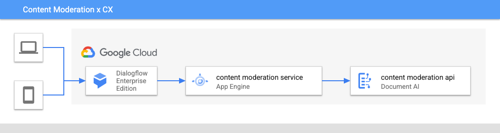

# Content Moderation x CX

Using the Content Moderation API in Dialogflow CX

This example consists of a service that mediates between a Dialogflow CX request and the Content Moderation API by creating CX Session parameters from the Content Moderation API comment analysis and an exported Dialogflow CX agent (in the `agent` folder) that implements routing based on the Content Moderation API attribute response.

Content Moderation webhook service calls the Content Moderation API and formats the toxicity attributes as CX Session Parameters for use in routing the CX bot.




## Prerequisites


Create a Document AI Content Moderation Processor

```shell
# enable the Document AI service
gcloud services enable documentai.googleapis.com

# create a docai content moderation processor
docaictl processors create --type CONTENT_MODERATION_PROCESSOR content-moderation-processor

```

## Deploy service


You can use either Cloud Run or AppEngine to deploy this containerized service.

Included is an app.yaml (`app.yaml.tmpl`) template that facilitates incorporating the Content Moderation API key into an AppEngine deployment. 

Notable are three env variables

* `PROJECT_ID` or `GOOGLE_CLOUD_PROJECT` - AppEngine supplies these by default
* `LOGNAME` for logging, defaults to `contentmoderation-x-cx`
* `CONTENT_MODERATION_NAME` this should refer to the Content Moderation Processor name (in the format of in the form of `projects/PROJECT_ID/locations/LOCATION/processors/PROCESSOR_ID`)

With App Engine: `gcloud app deploy`

With Cloud Run: `gcloud run deploy cx-content-moderation source . --region us-central1 --no-allow-unauthenticated`


## Create CX Agent

Create a new Dialogflow CX agent and restore the exported example agent in `agent` folder.

### Replace Webhook URL

From the App Engine or Cloud Run deployed service, a URL endpoint will be created. Replace the webhook named `content-moderation` with the URL provided, adding `/analyze` at the end.


## Test with CX Simulator

Open the Agent in the CX console and use the simulator to test the interaction.

### Optional: deploy as web page

See the `public` directory for an example HTML page and images using Dialogflow Messenger.

Enable the Dialogflow Messenger integration in the Dialogflow CX agent integrations and replace `agent-id` attribute value with your agent ID in the `<df-messenger>` element.


## Local testing

deploy locally

```shell
export PROJECT_ID=$(gcloud info --format='value(config.project)')
# if you used the one above, this is: content-moderation-processor
export CONTENT_MODERATION_NAME=
go run *.go
```

then test with

```shell
curl localhost:8080/analyze -d @samples/samplerequest.json
```

Or test against a deployed endpoint

```shell
curl ${ENDPOINT}/analyze
  -H 'Content-Type: application/json' \
  -H "Authorization: Bearer $(gcloud auth print-access-token)" \
  -H "X-Goog-User-Project: $(gcloud config get project)" \
  -d @samples/samplerequest.json
```