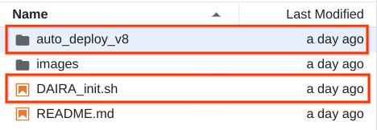
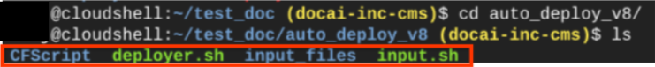

# DocumentAI Asynchronous Reference Architecture

## Overview of Document AI Toolkit - Asynchronous

The objective is to develop a document ai toolkit but this time instead of “Synchronous API” , **Asynchronous API** must be used  to increase the capabilities of the original document ai toolkit.
This tool should be capable of ingesting a number of documents,  batching the documents in the count of 50s, processing and providing the status for monitoring. This solution is packaged and made available to you.
You  also can take advantage of automated deployment without having to set up their environment and create each of the services which are utilized in this approach.

## Technology Overview

The following Google Cloud services are utilized for this pipeline.

* Google Cloud Storage
* Google Cloud Functions
* Google Cloud Firestore
* Google Cloud Document AI
* Google Cloud Scheduler


The above diagram highlights the overall architecture of DocumentAI Toolkit Asynchronous solution. The each phases to this solution is explained:

* **Documentation Ingestion & Services Initialization**: In this step, you are expected to run an initializer script that orchestrates required GCP services - Storage bucket, DocAI, Cloud Functions, Scheduler and Firestore. Also in this step,your  files are  input to the Cloud storage bucket for processing further. This is achieved by shell script which ensures the environment is set up automatically.
  * **Cloud Shell** : You need to run the provided shell script. This eliminates workarounds like manual setup of each service involved for this activity.
  * **Cloud Storage**: This is storage bucket where your  files are landed
* **Scheduled Async batch processing** : Processing (async batching) happens in this step. The Cloud Functions are triggered to perform the processing of the landed files from the Storage bucket of the previous step. Here, the files are grouped in batches of 50 and get processed concurrently.
     Next step is logging the activity and storing the data for visualization. The scheduler aids in automation of repeated workflow of this entire process i.e., from files ingestion to processing to logging.
  * **Cloud Functions gen2** : This service helps in running the python script where the core async batch processing logic is implemented.
  * **Cloud Storage** : a temporary directory is created to track every processing activity.
  * **Cloud scheduler** : Ensures the cloud functions are triggered automatically every hour.
* **Logging and Visualization**: With the help of a firestore database, datapoints such as status, output path, operation_id, timestamps are logged for every run. Data visualization can also be provided for the insights.
  * **Firestore Database**: This is a document database that stores key:value pairs. Data about each run logged in this database for  this context.
  * **Cloud Storage** : After async processing, the final output files are stored in the bucket in batch per batch.

## GCP Service Configurations

<table align="left" width="35%">
    <thead>
    <tr>
        <td><h3><b>GCP Service</td>
        <td><h3><b>Configuration</td>
    </tr>
    </thead>
    <tbody>
    <tr>
        <td>Google Cloud Storage</td>
        <td>Storage Class : Standard</td>
    </tr>
    <tr>
        <td>Google Cloud Functions (gen2)</td>
        <td>Memory allocated : 1 GiB<br>CPU : 1<br>Timeout : 3,600 seconds<br>Minimum instances : 1<br>Maximum instances : 100<br>Concurrency : 100</td>
    </tr>
    <tr>
        <td>Google Cloud Firestore</td>
        <td>Default</td>
    </tr>
    <tr>
        <td>Google Cloud Scheduler</td>
        <td>Frequency : Every hour<br>Target URL : Cloud Function</td>
    </tr>
    </tbody>
</table>

## Architecture Workflow diagram


The above diagram highlights the architecture and the each steps are explained:

1. Doc AI toolkit Installer script and your  input files.
    * You  are expected to run the initiator script from the Cloud Shell instance present in the Google Cloud UI. This is going to create and configure the required Google Cloud Services. For the first run,you  are expected to input their Google Cloud project details. More about the installer in the next section.
2. Landing bucket to store your  input files
    * In this step, you have  their input files located in the Input Bucket and considered for further processing.
3. Cloud Function (gen2) for Async Batch processing
    * Cloud Function gen2 contains the python script to perform async batch processing for the input files present in the landing bucket. The script first checks the logs(at 4) saved in Firestore and considers only files not processed earlier from the landing bucket, loads the files processing bucket,
       run the main async batch processing for the documents and save in the output bucket and finally log the activity in the Firestore Database.
4. Firestore Database for logging
    * Firestore is a Document Database which saves data in key:value pairs for every run as logs. Timestamp, status, filename and operation_id data are logged for each run.
5. Processing bucket
    * For every run, a temporary cloud storage bucket is maintained which is a processing bucket. This bucket holds files to be processed. As highlighted earlier, the processing bucket is going to store files which were not processed earlier. This is known from logs present in the Firestore. The processing bucket holds files in batch count of 50s. This bucket is truncated for every run.
6. Result bucket
    * This is the output storage bucket. It contains all of the output processed files for every run under the created directory named after the operation run_id.
7. Cloud scheduler
    * Cloud scheduler repeats Steps 2 to Step 6. Scheduler triggers the cloud function using the HTTP URL. The job is scheduled to run every 1 hour.

## Customer/Your deployment overview

You are provided the installer script that runs in the Cloud Shell environment.
The following steps are automated so that you can eliminate the steps involved in setting up their environment for this application to run.

* Initialization of the below Google Cloud services happens with the help of shell script for the following:
  * [Storage](https://cloud.google.com/storage/docs/creating-buckets#storage-create-bucket-cli)
  * [Cloud Function](https://cloud.google.com/functions/docs/create-deploy-gcloud)
  * [Firestore Database](https://cloud.google.com/sdk/gcloud/reference/firestore)
  * [Cloud Scheduler](https://cloud.google.com/scheduler/docs/creating#gcloud_1)  
  * [DocAI Processor](https://cloud.google.com/document-ai/docs/create-processor#documentai_create_processor-drest)
* Create, configure and deploy Cloud Functions
* Create Cloud storage buckets
* Set up Firestore for logging(python script builds this).
* Run the process automatically.

you can utilize the automated deployment feature. Below is the brief note about the installer:
Installer is a .zip file containing

* Shell Script
* Python Script
* Requirements.txt file
The Shell Script needs to be executed first. Its execution prompts to provide  your Google Cloud details like project name, project_id, location and output filename. This creates, configure and deploy the necessary services:
* Cloud Storage Buckets
* Invoice Processor
* Cloud Functions gen2
* Cloud Firestore
* Cloud Scheduler
Please note that this is a one time installation activity.
Next, the automated deployment steps are mentioned in details

## Benchmark: Count of Documents vs Processing Time

The below table and bar plot demonstrate the time taken in minutes to process a list of batch sizes 100, 200, 300, 400 and 500. Please note that this time noted is purely for the batch  async processing and does omit auto deployment jobs.
<table align="center" width="35%">
    <thead>
        <td><h3><b>Documents count</b></h3></td>
        <td><h3><b>Time(mins)</b></h3></td>
    </thead>
    <tr>
        <td>100</td>
        <td>9.93</td>
    </tr>
    <tr>
        <td>200</td>
        <td>10.20</td>
    </tr>
    <tr>
        <td>300</td>
        <td>12.78</td>
    </tr>
    <tr>
        <td>400</td>
        <td>14.26</td>
    </tr>
    <tr>
        <td>500</td>
        <td>20.44</td>
    </tr>
</table>


## Service Account details

**NOTE**: Users should have access for creating a Service Account for the project in use.

* Create Service Accounts
* Editor
* Project IAM Admin
* Project Viewer IAM  


You  need Project IAM Admin roles tagged to their account. This role enables users to tag mentioned roles to their service account that gets created.
The created and deployed service account needs to have the following roles for functioning of each service in the cloud:

* Cloud function developer
* Run invoker
* Document AI Editor
* Datastore User
* Storage Admin
* Service Account User
* Service Account Admin  


## Automated deployment Steps

Please note that this is a 1 time run session and if services are successfully deployed in this attempt, you need not run trigger installer script again.
Upon successful deployment, you can access the input storage in the GCP console and place any new documents in the previously deployed input bucket. The Cloud Scheduler runs every 1 hour and the newly added files in the input GCS bucket are considered and processed further.
 Follow the below steps to run 1 time installer script to deploy the services for this solutions:

* You need to  login into their GCP console using their account and open cloud shell as shown. Click on the cloud shell(1) and a cloud shell opens up at the bottom of the page(2).  


Download the auto_deploy_v8 and DAIRA_init.sh to your local computer. Note that the version may be updated (auto_deploy_v8) is considered for this example.  

     

Download the `utilities.py` file from the following link and place it inside the `/auto_deploy_v8/CFScript` folder on your local machine.

[Link to Download utilities.py](https://raw.githubusercontent.com/GoogleCloudPlatform/document-ai-samples/main/incubator-tools/best-practices/utilities/utilities.py)

* Now, convert the downloaded auto_deploy_v8 folder into a zip file named auto_deploy_v8.zip. You can zip the folder using any tool or library of your choice, based on your convenience.

* Next, with the shell terminal opened, find the option to upload files. This uploads files to your present working directory in the cloud shell.

  

  

* Use ‘cd’ command to change directory into the folder and ‘ls’ command to view the two uploaded files.
  * **auto_deploy_\<ver>.zip file** : This file is a compressed .zip file which contains necessary scripts and files to start and set up the project.
  * **DAIRA_init.sh file** : this shell script extracts the auto_deploy_\<ver>.zip file and provide a folder called ‘auto_deloy_\<ver>/’ in the same directory.

* Use the change mode command to provide permission to execute the DAIRA_init.sh shell script.

* Run the DAIRA_init shell script and obtain the folder as shown in the image below.

  

* Change directory into the auto_deploy_\<ver>/ folder and the below 4 files are observed.  
  * **Input.sh**:
        This is an input config file. You are  expected to provide the project details in this file and save. Here is an example project details input  

    * **PROJECT_NAME** : Input the project name which is currently being used.
    * **FUNCTION_NAME** : name for the cloud function which you created
    * **LOCATION** : location used `us` or `eu`.
    * **REGION_CLOUD_FUNCTION** : this input specifies the region to make use of for the Cloud function `us-central1` or `europe-west2`
    * **REGION_CLOUD_SCHEDULER** : this input specifies the region for cloud scheduler `us-west2` or `europe-west2`
    * **BUCKET_NAME** : input bucket name where the initial documents are saved and processed later, its value is `daira_shell_input06`(don't change this value)
    * **SCHEDULER_ACCOUNT_NAME** : name of the service account and it is utilized for authenticating the services which are deployed.
    * **SCHEDULER_NAME** : name for the cloud scheduler service.
    * **PROCESSOR_ID** : to make use of existing Document AI processor, use this parameter and populate the processor_id. If a new processor needs to be deployed then leave it blank.
    * **PROCESSOR_NAME** : this parameter takes the name of the Document AI processor to be created with the input name.
    * **PROCESSOR_TYPE** : which Document AI processor type to be deployed is specified here.
    * **OUTPUT_BUCKET_NAME** : this parameter is used for naming the deployed storage bucket. Here it refers to the storage output bucket.
    * **PROCESSING_BUCKET_NAME** : name of the bucket(temporary) utilized for execution of Cloud Function
    * **FIRESTORE_STORE_COLLECTION_NAME**: name of the collection to save the run logs.

        **NOTE** : Do not change `CONFIG_FIXED_PATH_NAME` data
    * **CONFIG_FIXED_PATH_NAME**: `daira_cinfig_path`  

    ```python
    PROJECT_NAME = "xx-xx"
    FUNCTION_NAME = "xx-xx"
    LOCATION = "xx"
    REGION_CLOUD_FUNCTION = "xx-xx"
    REGION_CLOUD_SCHEDULER = "xx-xx"
    BUCKET_NAME = "daira_shell_input06"
    SCHEDULER_ACCOUNT_NAME = "xx-xx"
    ## if processor is existing, enter its value otherwise keep it blank
    PROCESSOR_ID = "xx-xx"
    ## if PROCESSOR_ID was not provided, create processor and define its type,
    ## otherwise you can leave bith blank(optional)
    PROCESSOR_NAME = "xx-xx"
    ## define processor type
    PROCESSOR_TYPE = "xx-xx"
    OUTPUT_BUCKET_NAME = "xx-xx"
    PROCESSING_BUCKET_NAME = "xx-xx"
    FIRESTORE_STORE_COLLECTION_NAME = "xx-xx"
    CONFIG_FIXED_PATH_NAME = "daira_config_path"
    ```

  * **CFScript/** :
    * This folder contains two files which are pushed to Cloud Functions gen2. The files inside this folder are namely ‘main.py’ and ‘requirements.txt’.
    * main.py is the main script where the logic is implemented and the requirements.txt is a text file where the dependencies are defined.
  * **input_files/** :
    * This is the folder where you can place  their n number of files to process. For example, you can place 10 to 100s of PDF documents inside this folder.
  * **deployer.sh** :
    * This is a shell script that automatically configures and deploys necessary cloud services. More about this in the following points.
* Run the shell script.

  *   

* The automated deployment steps takes anywhere between 3 to 5 mins to setup and configure Google cloud services. Once completed, these services can be viewed in the console separately. The following are deployed services:
  * Service Account with the name defined when the automated deployment script was first run.
  * Document AI Invoice Processor.
  * Cloud function gen2 with python script and its dependencies configured.
  * Cloud scheduler is set up to trigger the cloud function on an hourly basis.
  * Firestore with the collection named ‘daira_logs/’ to store logs for every run.
  * Storage bucket created for following:
    * Input
    * Processing
    * Output
