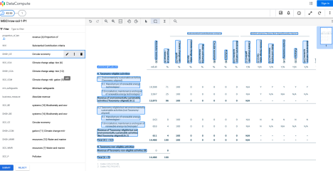
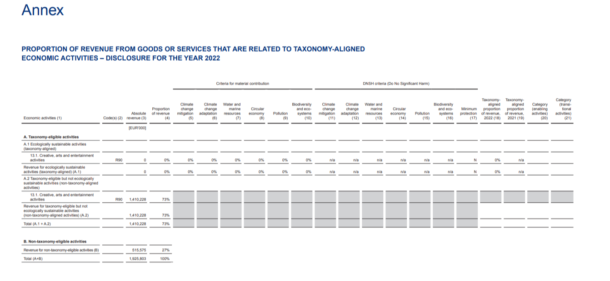
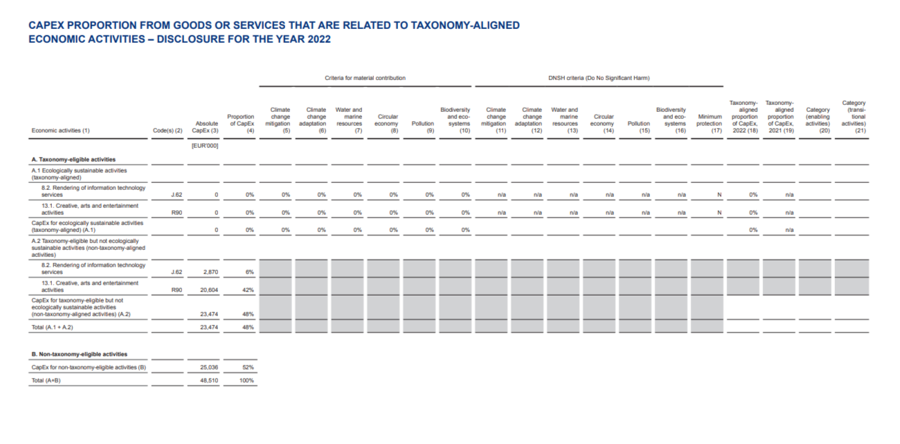
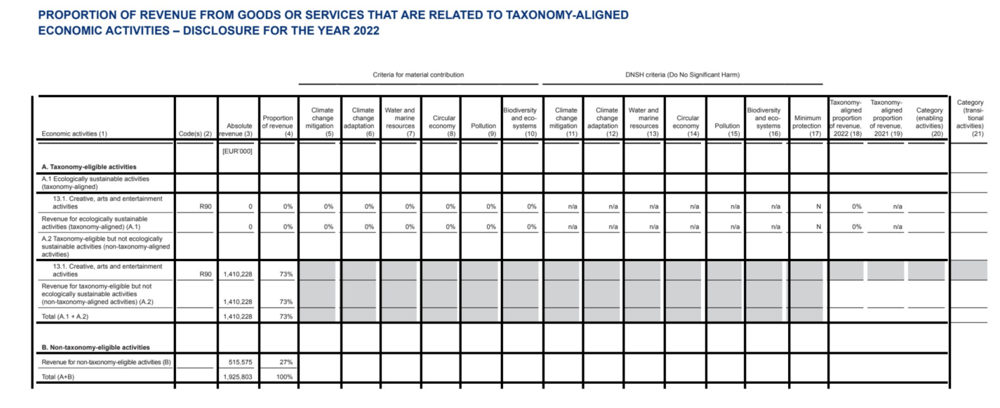
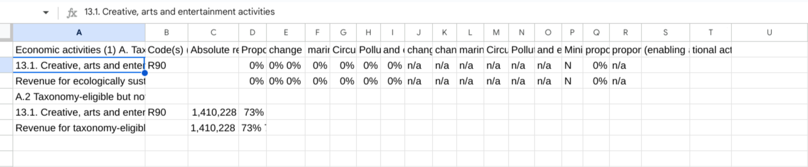
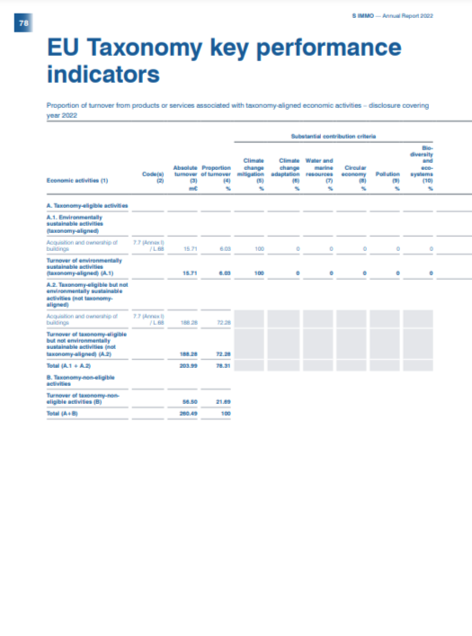
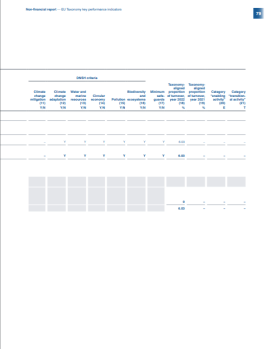
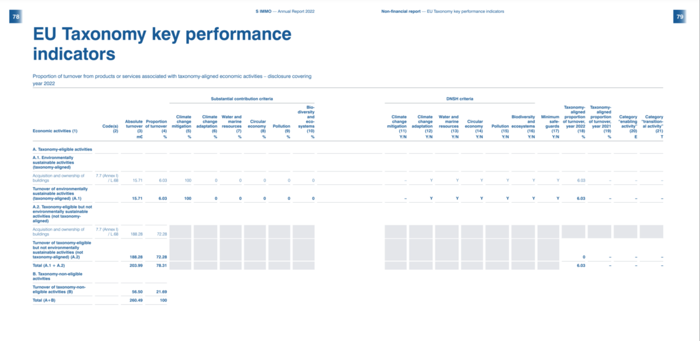

# Purpose and Description
This readme files contains information about 5 tools.

* 1. Line Enhancement Basic Flow : This tool built using Python programming language. It converts tables present in pdf to csv files and stores them in GCS bucket by enhancing input pdf files.

## Input Details for this tool : Input for this step is GCS bucket containing re-builted PDF files(which have only tables)
* **project_id**: GCP project ID
* **project_num**: GCP project Number
* **location**: Processor location `us` or `eu`
* **cde_processor_id**: CDE processor ID to call batch process
* **gcs_input_uri**: GCS folder which contains input pdf files(files with only specific-use-case tables)
* **input_mime_type**: Mime type of input files which is `application/pdf` here
* **gcs_output_bucket_uri**: GCS output bucket uri without trailing slash
* **gcs_output_uri_prefix**: GCS output folder path to store results
* **field_mask**:  To store specific keys of document proto (entities,pages.pageNumber)
* **timeout**: to wait for batch process LRO operation to complete
* **gcs_cde_hitl_output_prefix**: GCS folder which stored HITL output results fro CDE prpcessor
* **line_enhancement_vertical_offset**: Offset used to adjust the placement of the vertical lines, it can be tuned based on the layout
* **line_enhancement_horizontal_offset**: Offset used to adjust the placement of the horizontal lines, it can be tuned based on the layout
* **flow**: for this notebook file flow is `line_enhancement_basic`
* **fp_processor_id**: FP Processor ID to call batch process
* **fp_processor_v1**: FP version ID to call batch process
* **gcs_line_enhance_output_prefix**: GCS prefix to store Line enhancement results
* **gcs_fpoutput_uri_prefix**: GCS prefix to store FP results

Sample image after training CDE processor for row columns & header columns
<table>
  <tr>
      <td><b>CDE Sample</b></td>
    <td></td>
  </tr>
</table>

## Output Details : Table Sample from pdf file
</img>

* 2.Table Parsing using CDE Headers and Form Parser : This tool built using Python programming language. It converts tables present in pdf to csv files and stores them in GCS bucket without enhancing input pdf files by parsing them through Form Parser & CDE results.

## Input Details for this tool : Input for this step is GCS bucket containing PDF files(which has only your specific-use-case tables)

* **project_id**: GCP project ID
* **project_num**: GCP project Number
* **location**: Processor location `us` or `eu`
* **cde_processor_id**: CDE processor ID to call batch process
* **gcs_input_uri**: GCS folder which contains input pdf files(files with only specific-use-case tables)
* **input_mime_type**: Mime type of input files which is `application/pdf` here
* **gcs_output_bucket_uri**: GCS output bucket uri without trailing slash
* **gcs_cde_output_uri_prefix**: GCS output folder path to store CDE results
* **gcs_fp_output_uri_prefix**: GCS output folder path to store FP results
* **gcs_cde_fp_output_uri_prefix**: GCS prefix to store ocr walk final output results
* **field_mask**: To store specific keys of document proto (entities,pages.pageNumber)
* **timeout**: to wait for batch process LRO operation to complete
* **flow**: for this notebook file flow is `ocr_walk`
* **fp_processor_id**: FP Processor ID to call batch process

Sample image after training CDE processor for row columns & header columns
<table>
  <tr>
      <td><b>CDE Sample</b></td>
    <td></td>
  </tr>
</table>

## Output Details : One of the table Sample from pdf file
</img>

* 3.FP_tables_to_csv : This tool built using Python programming language. It converts tables present in pdf to csv files and stores them in GCS bucket by using Form Parser results.

## Input Details : fp_tables_to_csv
* **project_id**: GCP project ID
* **location**: Processor location `us` or `eu`
* **fp_processor_id**: FP Processor ID to call batch process
* **gcs_input_uri**: GCS folder which contains input pdf files(files with only specific-use-case tables)
* **input_mime_type**: Mime type of input files which is `application/pdf` here
* **gcs_output_bucket_uri**: GCS output bucket uri without trailing slash
* **gcs_output_uri_prefix**: GCS output folder path to store results
* **field_mask**:  To store specific keys of document proto (entities,pages.pageNumber)
* **timeout**: to wait for batch process LRO operation to complete
* **fp_processor_v**: FP version(V1 or V2) ID to call batch process

## Output Details : output sample for one-table which stored as csv files in GCS bucket
</img>

* 4. Table Extraction with Line Enhancement : This tool built using Python programming language. It converts tables present in pdf to csv files and stores them in GCS bucket by enhancing input pdf files & parsing them through both Form Parser & CDE results.

## Input Details for Table Extraction with Line Enhancement
* **project_id**: GCP project ID
* **project_num**: GCP project Number
* **location**: Processor location `us` or `eu`
* **cde_processor_id**: CDE processor ID to call batch process
* **gcs_input_uri**: GCS folder which contains input pdf files(files with only specific-use-case tables)
* **input_mime_type**: Mime type of input files which is `application/pdf` here
* **gcs_output_bucket_uri**: GCS output bucket uri without trailing slash
* **gcs_output_uri_prefix**: GCS output folder path to store results
* **field_mask**:  To store specific keys of document proto (entities,pages.pageNumber)
* **timeout**: to wait for batch process LRO operation to complete
* **gcs_cde_hitl_output_prefix**: GCS folder which stored HITL output results fro CDE prpcessor
* **line_enhancement_vertical_offset**: Offset used to adjust the placement of the vertical lines, it can be tuned based on the layout
* **line_enhancement_horizontal_offset**: Offset used to adjust the placement of the horizontal lines, it can be tuned based on the layout
* **flow**: for this notebook file flow is `line_enhancement_basic`
* **fp_processor_id**: FP Processor ID to call batch process
* **fp_processor_v2**: FP version2 ID to call batch process
* **gcs_line_enhance_output_prefix**: GCS prefix to store Line enhancement results
* **gcs_fpoutput_uri_prefix**: GCS prefix to store FP results

## Output Details

Table sample of pdf file after running **enhance_save_pdfs** function
</img>

output sample for one-table which stored as csv files in GCS bucket
</img>

* 5. Table Spanning Page Merge Script : DocumentAI Page Merger is a tool built using Python programming language. Its purpose is to provide technique for merging table(Specific use case tables) which spans across two pages. This document highlights the working of the tool(script) and its requirements.

## Input Details for Table Spanning Page Merge Script
* **PROJECT_ID** : Provide your GCP Project ID
* **LOCATION** : Provide the location of processor like `us` or `eu`
* **PROCESSOR_ID** : Provide ID of CDE processor
* **FOLDER_PATH** : Folder which hold input pdf files(pdf pages should be having only use-case table pages)
* **OUTPUT_FOLDER** : Set your output folder path where the merged pdfs should be stored in your local system
* **MIME_TYPE** : Provide mime type of input documents
* **COL_HEADERS** : Provide list of all entities(entity type) which are annotated in CDE processor to identify *column headers*
* **ROW_HEADERS** : Provide list of all entities(entity type) which are annotated in CDE processor to identify *row headers*

## Output Details for Page Merger Script
## Input file have table across two pages
<table>
  <tr>
    <td></td>
    <td></td>
  </tr>
 </table>

## After running page_merger script you can find table in single page

<table>
  <tr>
    <td></td>
      <td> </td>
  </tr>
    </table>
