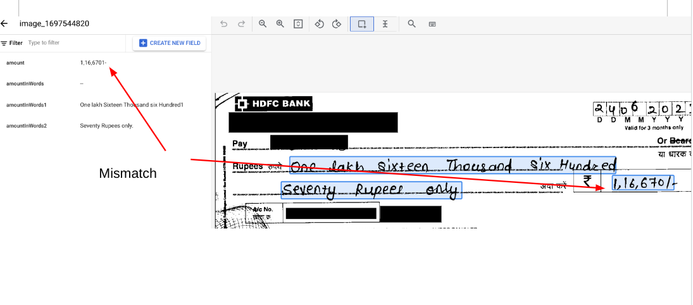
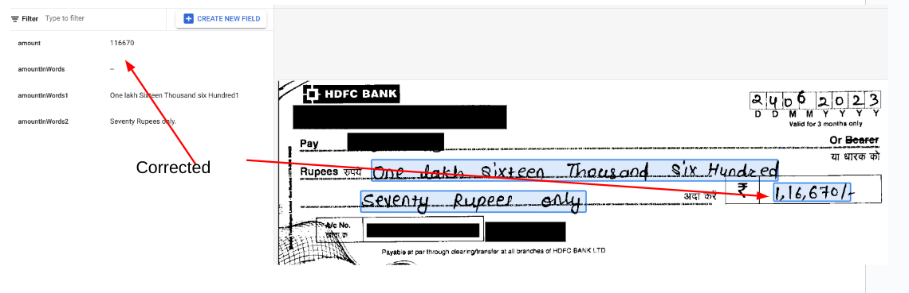

# Purpose and Description

This document provides instructions for rectifying the amount in cheques using the words with entity types and parsed jsons as input.

# Input Details
* This tool was developed to address output produced by a processor trained on a dataset of cheques. <b>Alter the "amount_in_words_entity_name" and "amount_in_figures_entity_name" list values to modify to fit your use case.</b>
* **input_path** : GCS Input Path. It should contain DocAI processed output json files. 
* **output_path** : GCS Output Path. The updated jsons will be saved in output path. 
* **project_id** : It should contains the project id of your current project.
* **amount_in_words_entity_name** :  entity name for letters
* **amount_in_figures_entity_name** : entity name for figures

# Output Details

The corrected jsons will be saved in output path.

#### Issue file

</img>

#### Corrected file will be as below

</img>