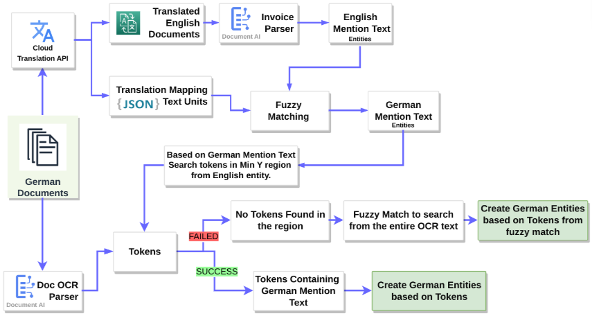
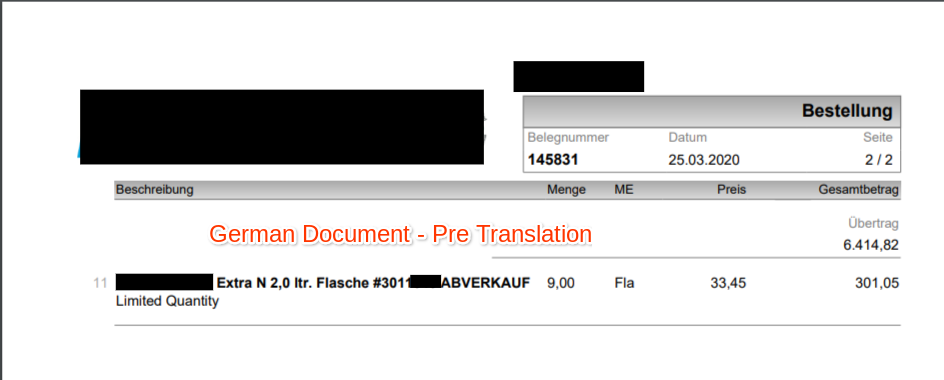
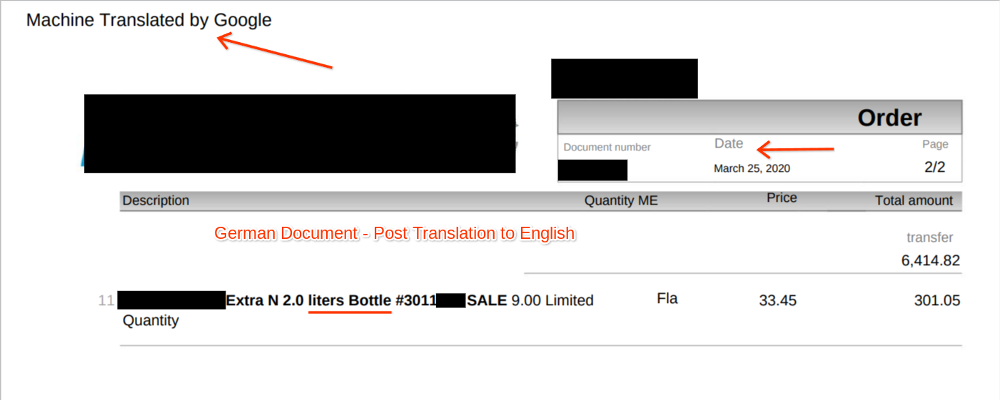
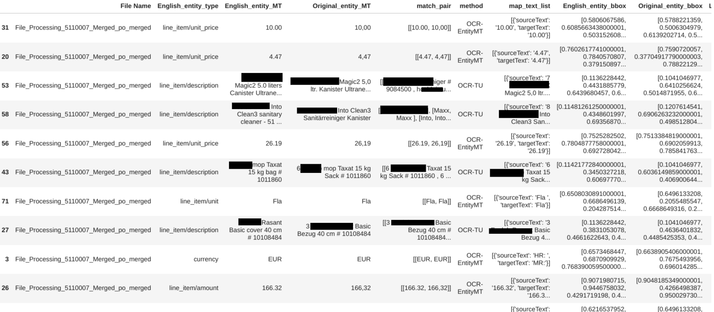

# Purpose and Description

This document guides to backmap the entities from the parser output which is trained in different languages to the original language of the document using google translation API.

## Workflow to BackMap the Entities to Original language

</img>

## Input Details
* **PROJECT_ID**: GCP project ID
* **LOCATION**: Location of DocumentAI Processor, either `us` or `eu`
* **PROCESSOR_ID**: DocumentAI Parser ProcessorID
* **PROCESSOR_VERSION_ID**: DocumentAI Parser processor version id
* **ORIGINAL_SAMPLES_GCS_PATH**: GCS folder apth containing native-language(non-english) documents
* **OUTPUT_BUCKET**: GCS output bucket-name to store results(with-out gs://)
* **OUTPUT_GCS_DIR**: Output folder path to store results in above mentioned output-bucket(with-out gs://)
* **MIME_TYPE**: Mimetype of input documents
* **TRANSLATION**: `True` if you needed translation of documents from non-eng to english language, otherwise `False`
* **BACKMAPPING**: `True` if you needed backamapping of entities from parser-output to original language(non-english), otherwise `False`
* **SAVE_TRANSLATED_PDF**: `True` if you need to store translated doc-results of Cloud Translation API output results
* **ORIGINAL_LANGUAGE**: Provide language code of original documents. eg:- '`de`' for greek input files
* **TARGET_LANGUAGE**: Provide target language code. eg:- '`en`' to sonvert to english
* **DIFF_X**: X-coordinate offset
* **DIFF_Y**: Y-coordinate offset

## Output Details
1. Raw Document sample(Greek PDF sample)  
    </img>   

2. After Translation from Greek to English using Cloud Translation API
     </img>\n

3. After using Translation API, every translated document contains `Machine Translated By Google` text at top-left conrner of translated page
    </img>

4. Sample CSV output file data for comparision between original document entities mention text and translated document mention text
    </img>

