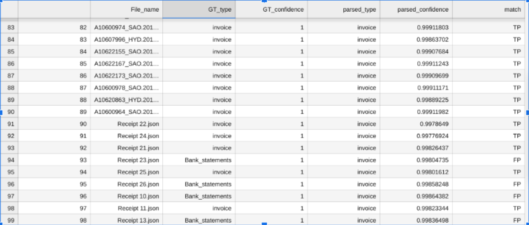
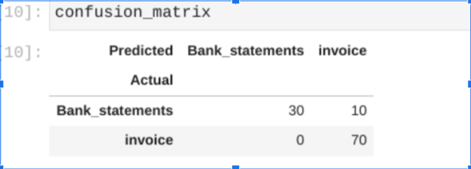
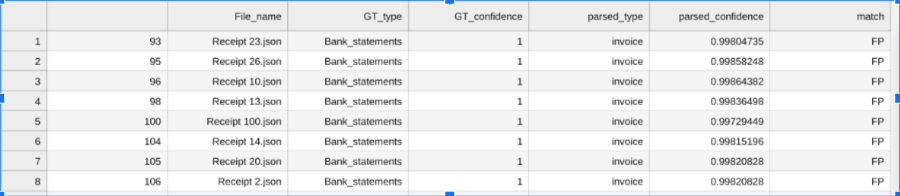

# Purpose and Description

This tool uses ground truth and parsed CDC json files to develop a confusion matrix and list of files where the predicted and ground truth doesn't match. This helps to identify which classes are being confused by the model and this can be retrained with more samples and strengthen the model.

## Input Details

* **project_id** : Enter your project ID.
* **GT_GCS_path** : Enter the GCS folder where groundtruth is saved. 
* **parsed_GCS_path** : Enter the GCS folder where parsed json is saved.

## Output Details

The tool provides output in 4 formats

1. **CDC_comparision.csv**:
   This CSV file is the comparison between classifier ground truth and parsed json file.

   This tool considers only the type of document which has maximum confidence in the predicted json files.

   Below screenshot shows the sample of csv file , the column names are self explanatory and match column indicates TP(true positive) if ground truth and prediction matches else it is FP(false positive)

</img>

2. **Confusion_matrix**:
    This gives the confusion matrix for predicted and Actual classes as sample shown below.
</img>

3. **Prediction_errors.csv**:
 This CSV file is the same as **CDC_comparision.csv** but with an added filter of files where there is difference  in ground truth and prediction.

</img>

4. **Error_predicted_files**:
It is the list of files which are predicted wrong.
