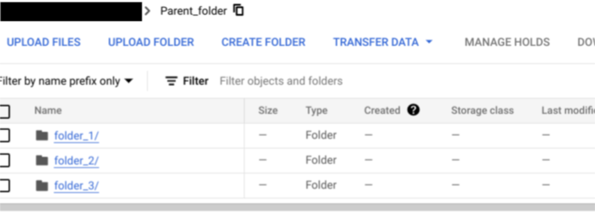

# Purpose and Description

Users of Custom Document Classifier (CDC) often have document files organized by class in separate folders and just want to import those as annotated into the CDC processor dataset, rather than label them in the processor console. This document is a guide for the tool to do that.

The tool will run an OCR processor over the files residing at a provided GCS input directory and save the json files to a specified output GCS directory.  Ultimately, the tool will add an entity [document] ‘type’ into each json file with the value designated by each folder, as the documents are already segregated by the folders.

## Organize the folders

* Follow this convention of folder structure:  
Parent Folder
<pre>
--->  folder for doc_type1
---> folder for  doc_type2
---> folder for doc_type3
</pre>
## Example
  

## Input Details

* **PROJECT_ID**: GCP project-id
* **LOCATION**: Provide the location of processor created (`us` or `eu`)
* **PROCESSOR_ID**: Provide Custom Document Classifier(CDC) Processor Id
* **GCS_INPUT_PATH**: Provide the gcs path of the parent folder where the sub-folders contain input files. Please follow the folder structure described earlier.
* **GCS_OUTPUT_PATH**: Provide gcs path where the output json files have to be saved
* **DOCUMENT_TYPE_DICT**:  provide the folder name and type of documents in the folder available in a dictionary format  as below ({Folder_name1:Doc_type1,Folder_name2:Doc_type2})
        * Example: `{Folder1:Invoice, Folder2: Bank_statements}`
