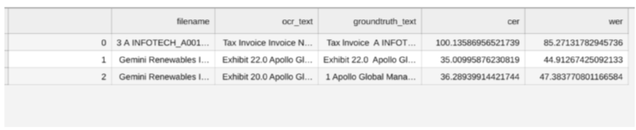

# Purpose and Description

The objective of the tool is to evaluate the character error rate and word error rate .
# Input Details

* **JSONS_PATH**: Provide the location of the dataset  exported from the processor which needs to be evaluated
* **GROUNDTRUTH_PATH**: Provide the location of the ground truth which is the text file containing the content of the document in txt file.

Note: The json file and its corresponding groudtruth should have the same name.

# Output Details

Reference output csv image as below  
