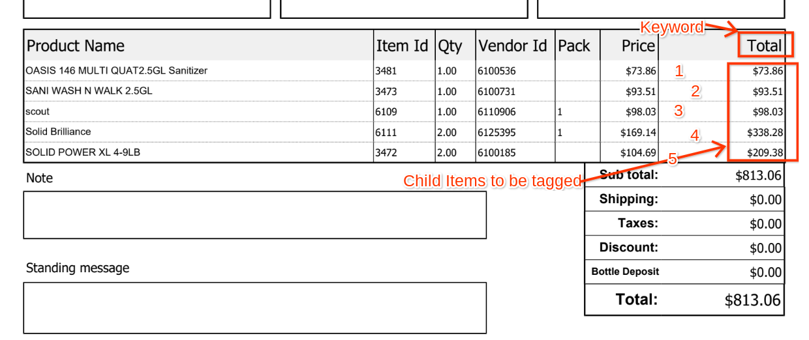
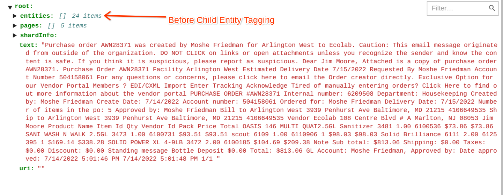
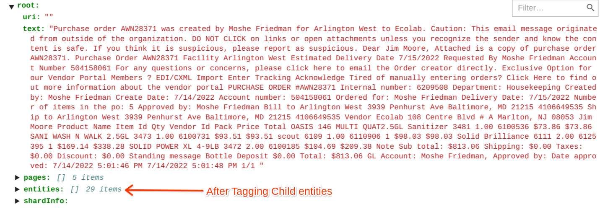
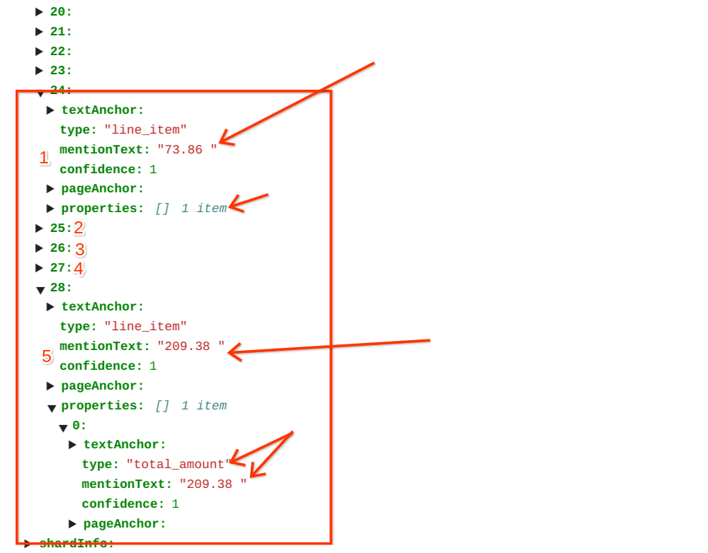

# Purpose and Description
This tool uses labeled json files stored in GCS bucket and header key-words as input list and creates a new child entity tagging the values under the header keyword matching.

**Example**

All those `5-tokens` needs to convert as entities of type `line_item` & its child-entities of type `total_amount`

## Input Details
* **GCS_INPUT_PATH:** provide the folder name of the input jsons which needs to be processed.
* **GCS_OUTPUT_PATH:** provide for the folder name where jsons will be saved after processing.
* **LIST_TOTAL_AMOUNT:** This is the list of header words have to be used and the values under those headers will be tagged with child type total_amount_type.
* **TOTAL_AMOUNT_TYPE:** enitity name under which values will be tagged.
  
## Output Details
The items which are below the matched keyword will be tagged as entity name given
<table>
    <tr>
        <td> Sample JSON-Input file, Entities Count(24)</td>
        <td>  </td>
    </tr>
    <tr>
        <td> Sample JSON-Output file, Entities Count(25+4)</td>
        <td>   </td>
    </tr>
</table>

JSON Sample output after tagging child-entities, **5-new entities** added to Document Proto  
</img>