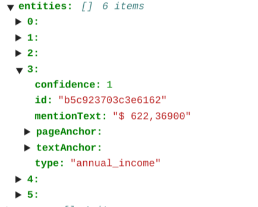
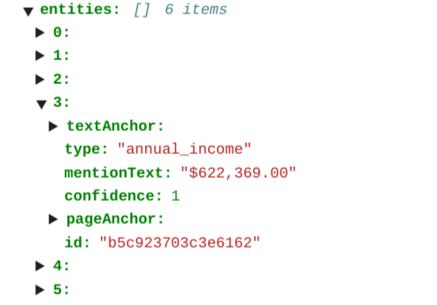
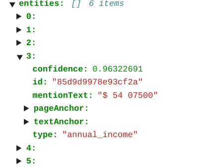
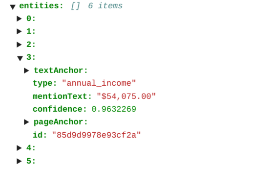

# Purpose and Description
This tool is to clean amount entity, which cleans the mention_text and converts it to business readable text data.

# Input Details
* **INPUT_GCS_PATH** : It is input GCS folder path which contains DocumentAI processor JSON results
* **OUTPUT_GCS_PATH** : It is a GCS folder path to store post-processing results
* **AMOUNT_ENTITY_TYPE** : The amount type of an entity to consider for cleaning and converting it to business readable text data(give type of entity here)
* **IS_CURRENCY_EXIST**: If currency symbol exists at beginning of amount entity text provide `True` otherwise `False`

# Output Details

Refer below images for preprocessed and postprocessed results
<table>
    <tr>
        <td>
            <b>Pre-processed data</b>
        </td>
        <td>
            <b>Post-processed data</b>
        </td>
    </tr>
    <tr>
        <td>
            </img>
        </td>
        <td>
            </img>
        </td>
    </tr>
    <tr>
        <td>
            </img>
        </td>
        <td>
            </img>
        </td>
    </tr>
    </table>
    