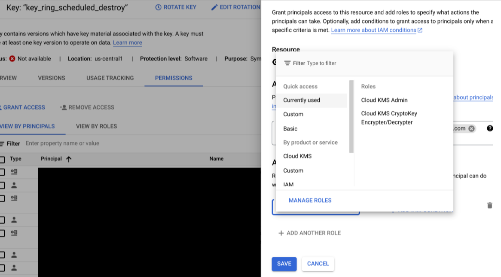

# Purpose and description

This Document guides how to create Docai processor using CMEK key and rotate the key in regular basis. Delete the old processor after copying trained processor into New one.

## Step by step procedure

1.CMEK KEY CREATION & DESTROYING

To Manage key through Python Jupyter notebook ,the service account which is used for notebook should have the below roles for creating CMEK key and creating processor using key.

**IAM Roles**

* Cloud KMS Admin
* Cloud Document Understanding AI Resource Admin (or Document AI Admin)
* Storage Admin

2.Key ring is mandatory to create a CMEK key. These are the inputs required for key ring creation:

* **Project_id** : Project ID of the project
* **Location_id** : Location of the CMEK key to be created
* **Key_ring_id** : Unique key name has to be provided for the new key ring

3.Creates a new symmetric encryption/decryption key in Cloud KMS (without rotation)

4.Creates a new key in Cloud KMS that automatically rotates.

### After creating GCS bucket, processor creation, training/transmission of data from old processor to new processor we need to destroy the created key

5.Once we destroy a key we can retrieve and enable the key within 24 hours by default. Any data encrypted with this key version will not be recoverable after 24 hours of destroying.

### Grating access to key for DOC AI and Cloud storage

* To use the CMEK key to create a Doc AI processor and GCS bucket , we need to grant cloud KMS cryptokey Encrypter/Decrypter access for service agents in the CMEK key.
</img>
