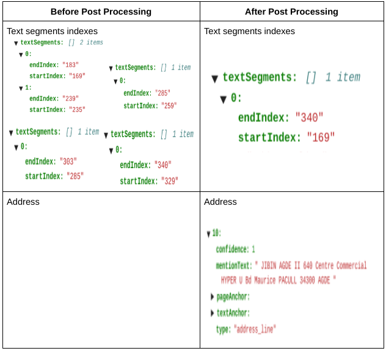
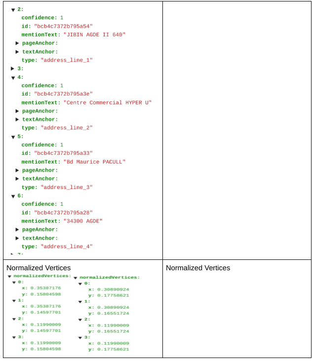
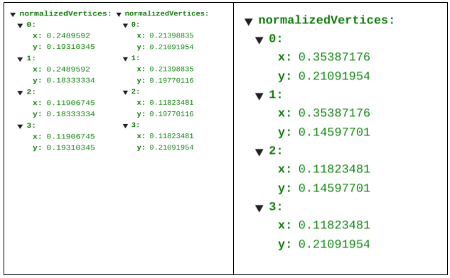
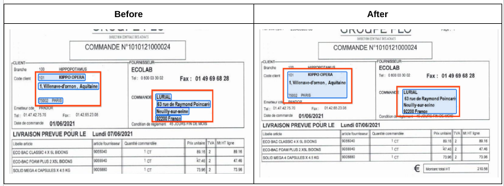

# Purpose and Description

Customer requires a post processing script which combines the split address into one address. In the parsed sample json file it is observed that the single address_line item has been split into four multiple address_lines.

This can be corrected by combining the address lines into a single address and removing other split address elements in the json. The json Entity keys Normalized Vertices and Text Segments indexes are to be updated properly with correct values when the address line is combined.

## Prerequisites

1. Vertex AI Notebook

2. Parsed json files in GCS Folder.

3. Output folder to upload the updated json files.

## Step by Step procedure

### 1. Input details

input_path: GCS Storage name. It should contain DocAI processed output json files. This bucket is used for processing input files and saving output files in the folders. 

output_path: GCS URI of the folder, where the dataset is exported from the processor. 

Entity_names : list of entity_names that needs to be combined.

### 2. Output
The post processed json field can be found in the storage path provided by the user during the script execution that is output_bucket_path.  

<b>Comparison Between Input and Output File</b>  

<i><h4>Post processing results<h4><i> 

Upon running the post processing script against input data. The resultant output json data is obtained. The following table highlights the differences for following elements in the json document. 

<ul style="margin:5px">

    <li>Address</li>

    <li>Normalized Vertices</li>

    <li>Text Segment indexes</li>

<ul>

When the output json document is imported into the processor, it is observed that the address is now a single entity and the bounding box as shown:  

