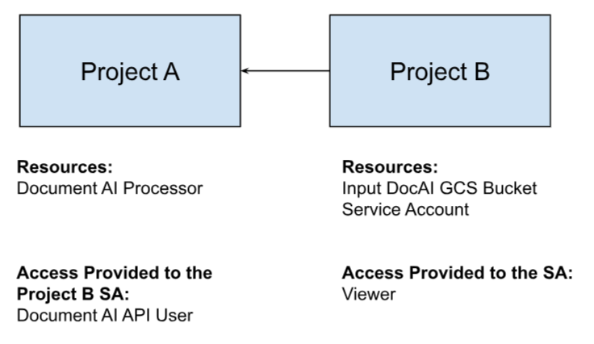
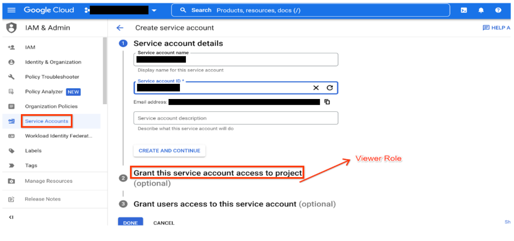
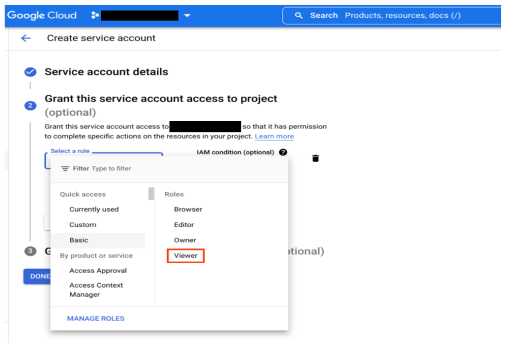
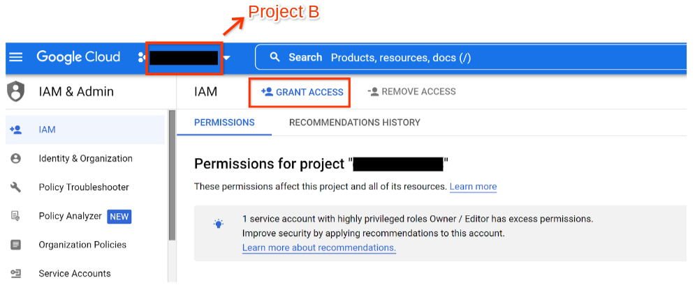
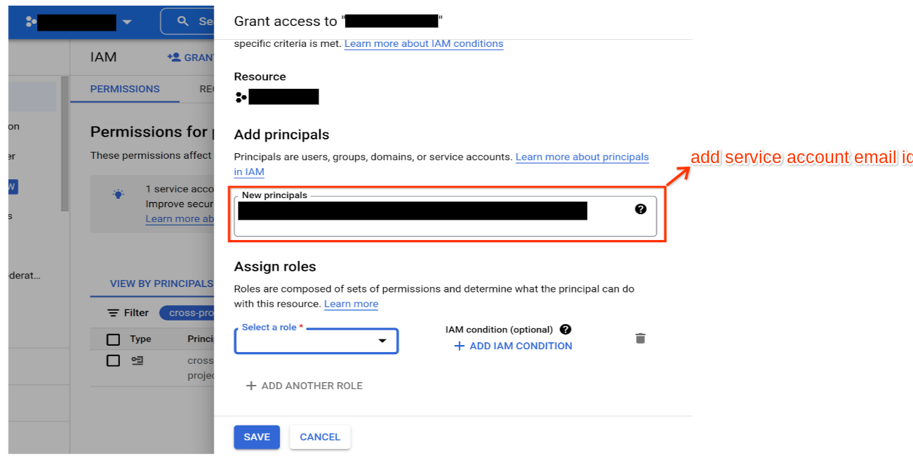
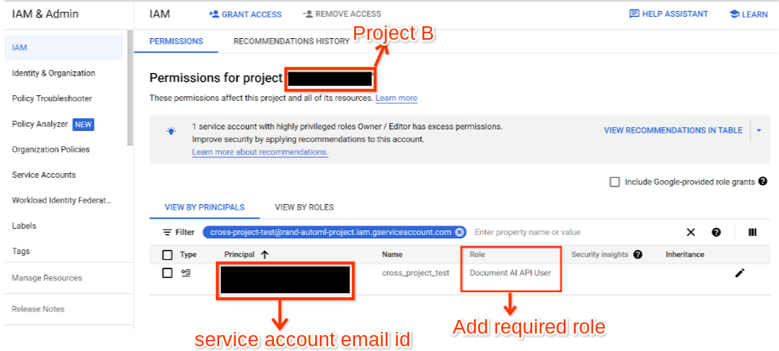

# Purpose and Description

## Overview

* Suppose Project A hosts a Document AI processor.
* Project B owns the bucket that contains input files for Document AI processors, and optionally hosts a bucket to which processor output is written.
* To make the processor available in project A accessible to Project B, please follow the steps described below.

</img>

## Input and Output Details

### Step 1

Create a service account in Project B and assign a Viewer role (**Project/Basic Viewer** - see screenshots below) to it. This is the minimum rights necessary.

**Note**: Use this Service Account To Call the Document AI API’s.

## Project - A
</img>

</img>

## Step 2

Add the Service account of Project B in Project A along with the following roles:
* **Document AI API User**

Document AI API User - Grants access to process documents in Document AI

## Project - B

</img>

### Click on “Grant Access” and add the service account email id in New Principal and assign the required role to it

### Adding service account email id

</img>

### Adding Required Role

</img>
