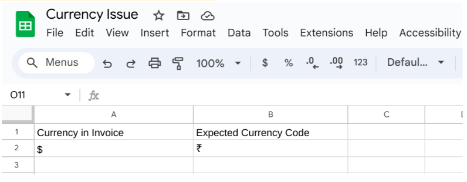
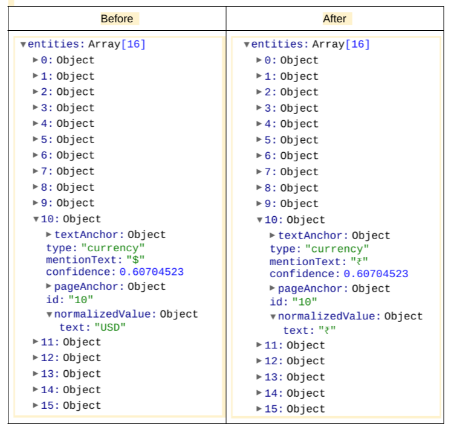

## Objective

This document guides you to use the currency normalization tool which uses parsed jsons and excel file (which has parsed currency prediction and desired currency name) to normalize the currency entity to desired value.

# Input Details
* **gcs_input_path** : GCS Input Path. It should contain DocAI processed output json files. 
* **gcs_output_path** : GCS Output Path. The post-processed json files stored in this path. 
* **project_id** : It should contains the project id of your current project.
* **column_key** : It should contain the name of the column which should be considered as Key to convert(already existing currency format)
* **column_value** : It should contain name of column which should be considered as Value to convert(desired format to Convert)
* **updated_entity** : This should contain name of the entity to be converted.
* **excel_path** : Screenshot from sample file: 

</img>

# Output Details

The post processed json field can be found in the storage path provided by you during the script execution that is output_bucket.  
</img>
