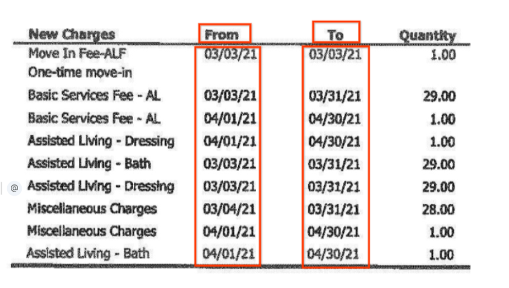
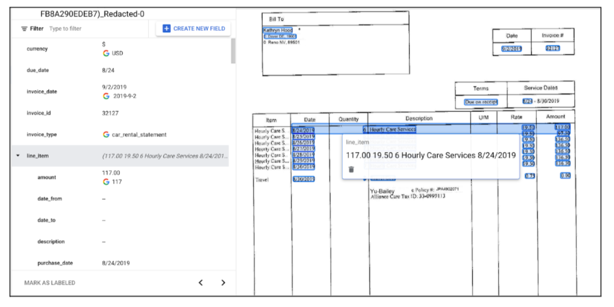
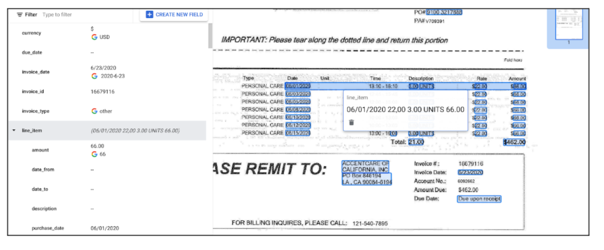
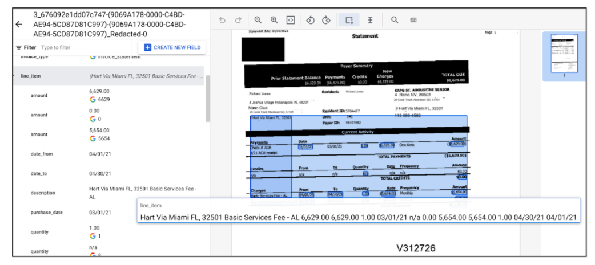
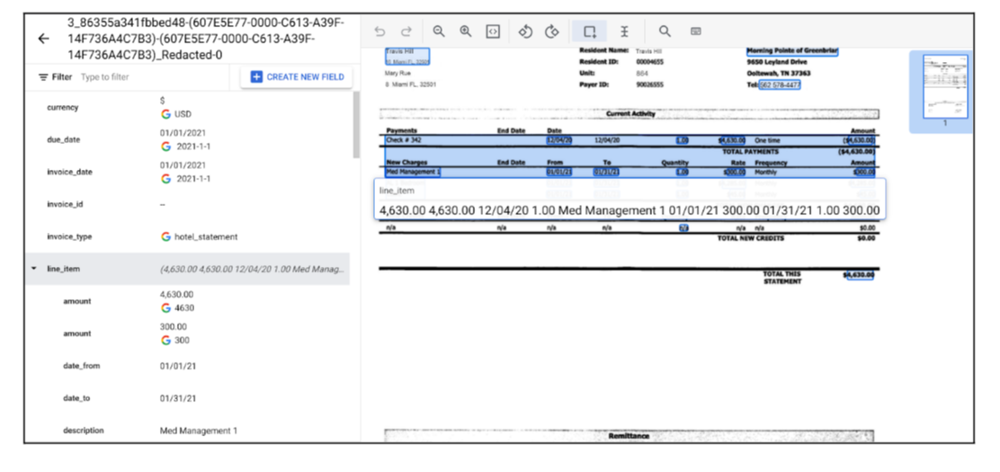

# Purspose and Objective
This tool helps you **annotate or label date entities** in a table as line items. The names of date entities are tagged based on the header of the line items table. You can modify the header text to suit your needs and annotate the date values as line items. 
The notebook script expects the input file containing the invoice parser json output. The dates gets annotated if they are present in the OCR , and the headers are also recognized by the OCR.
The result is an output json file with the labeled date entities as line items and exported to a storage bucket path. These result json files can be imported into a processor to further check the annotations and can be used for training.

## Input Details
* **project_id**: This contains the project ID of the project.
* **Gcs_input_path**: This contains the storage bucket path of the input files.
* **Gcs_output_path**: This contains the storage bucket path of the output files.
* **headers_entities**: This contains the table's header as the key and the associated entity name as its value
  * eg {'From':'line_item/date_from','To':'line_item/date_to','DESCRIPTION':'line_item/purchase_date','Date':'line_item/purchase_date'}
* **Desc_merge_update**: If you want to combine description within the line item then give `Yes` otherwise `No`
* **line_item_across_pages**: If you want to group line items across pages, then give `Yes` else `No`

## Output Details

</img>
</img>
</img>

### Edge Case Output Details
The line item merging may not work as expected for some documents due to the layout. This is illustrated in the screenshot below
</img>
</img>