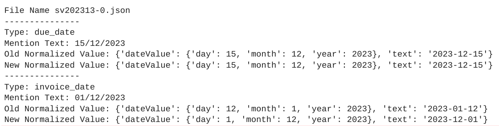

# Purpose and Description

This tool updates the values of normalized dates in entities within the Document AI JSON output. It aids in identifying the actual date format, such as MM/DD/YYYY or DD/MM/YYYY, through a heuristic approach. Upon successful identification, the tool updates all date values in the JSON to maintain a consistent format.

## Prerequisites

1. Vertex AI Notebook or Google Colab
2. GCS bucket for processing of  the input json and output json

## Step by Step procedure

### 1. Input Details

<ul>
    <li><b>input_path :</b> GCS Storage name. It should contain DocAI processed output json files. This bucket is used for processing input files and saving output files in the folders.</li>
    <li><b>output_path:</b> GCS URI of the folder, where the Output Json files will store.</li>
</ul>

### 2.Output Details

The post processed json field can be found in the storage path provided by the user during the script execution that is output_bucket_path.  

<b>Comparison Between Input and Output File</b>  
<i><h4>Post processing results<h4><i> 
Upon running the post processing script against input data. The resultant output json data is obtained. The following image will show the difference date formate in the date filed  

