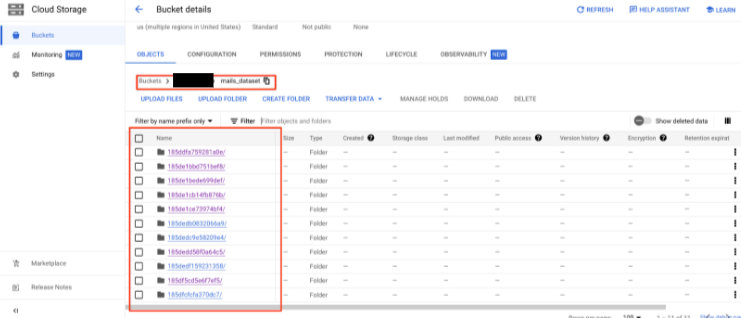
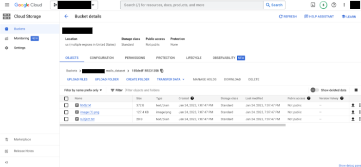

# Purpose and Description

1. Dialogflow Email Integration tool which can be used to fetch the mail, analyze the body to get the relevant gcp services  and send a response with the help of dialogflow agent as a mail. [DocAI Dialogflow CX]

2. DocAI Email ingestion via Cloud function which can be used to ingest all the emails with their body, subject and the attachments and store it in the cloud bucket. [Email Ingestion Tool]

## Input Details

* **GMAIL_ID** : The email address of the agent / support gmail inbox.
* **GCP_PROJECT** :   GCP project id.
* **LOCATION** : The location of the agent which can be found in the Dialogflow CX console. ex. us-central1
* **AGENT_ID** : The id of an agent which can be found in the Dialogflow CX console.
* **SUBJECT_KEY** : The subject you needs to use in order for a response to be sent from the application. This prevents unwanted emails from being sent by our application.
* **ENTITY_EXTRACT_MODEL_ID** : The id of the entity extraction model which can be found in the AutoML Natural Language console for the deployed model.
* **TOPIC_CLASSIFY_MODEL_ID** : The id of the topic classification model which can be found in the AutoML Natural Language console for the deployed model.

## Output Details

Output from this script is stored in a bucket with folder name mentioned in config.yaml file as OUTPUT_PATH with respective mails IDs as folders inside it.

Inside each folder there is  subject.txt containing the subject of that email, body.txt containing body of the mail and the attachments with their name in the email.

