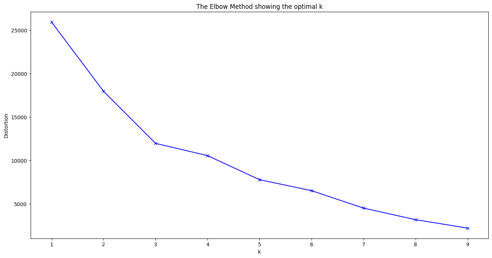
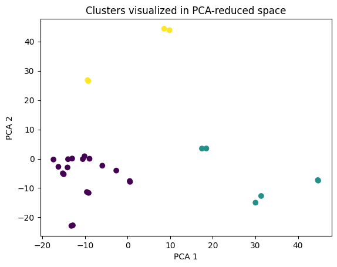

# DocAI PDF Clustering Analysis Tool

## Objective

The tool is designed to perform advanced image analysis and clustering on PDF documents.
It utilizes the VGG16 deep learning model to extract and process image features from PDF pages,
applies PCA for dimensionality reduction, and employs K-Means clustering to categorize the images into distinct groups.
The tool aims to facilitate efficient organization and analysis of visual data contained in large sets of PDF files.

## Practical Application
This tool was created to aid in extracting tables from documents with varied layouts, responding to a
customer's need to handle hundreds of uniquely formatted documents efficiently. By using clustering
analysis, it helps in categorizing documents to facilitate easier management and analysis. This enables
users to better understand their document variations and streamline the extraction process, making it
highly beneficial for those looking to efficiently manage and analyze a large volume of PDF documents.

## Clustering Analysis Output

 </img>

 </img>
