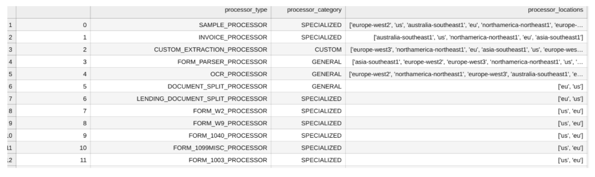

# Objective
This script is useful to check the available processors types of DocumentAI Service.

# Input Details
* **project_number**: Give GCP Project Number here
* **location**: Give location as either `us` or `eu`

# Output Details
Upon successfull running of `processor_types` function from notebook. It will create **(Processor_types.csv)**
It has following headers _processor_type_, _category_ and _processor_locations_
* **processor_type**: Type of processor eg- OCR_PROCESSOR, SAMPLE_PROCESSOR, INVOICE_PROCESSOR......
* **category**: Category of a particular processor eg- GENERAL, CUSTOM & SPECIALIZED
* **processor_locations**: Available locations for specific processor eg- us, eu, europe-west2...

#### Sample utput data as below
</img>