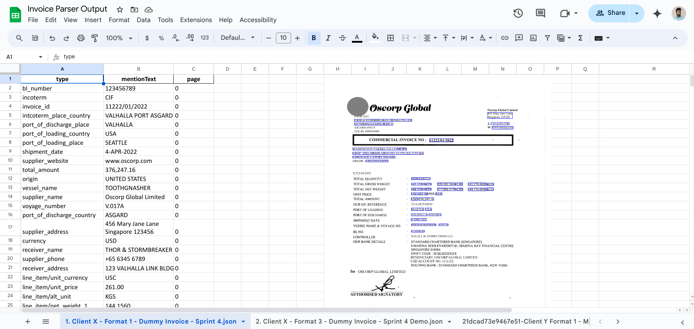

# Document AI Processor Visual Assessment Tool

## Objective

The Python script is designed to produce an Excel report from the provided PDFs using a chosen Document AI processor. This report offers a snapshot of the entity extraction by the processor from the PDFs and visually presents the bounding boxes within the images in the Excel sheet.
For the Form Parser, the report will detail the key-value pairs and the table structures. For other processors, the report will showcase the predicted entity types paired with the corresponding mention text.

## Prerequisites

* Python : Jupyter notebook (Vertex AI)
* Permission to the Google project is needed and ccess to Document AI processor

### Setup the required inputs

project_id = "\<your-project-id\>"

processor_id = "\<your-processor-id\>"

bucket_name = "\<bucket-name\>"

input_pdfs_path = "gs://\<bucket-name\>/\<subfolder-name\>"

* `project_id`: The ID of the project where your Document AI processor and storage bucket are located.
* `processor_id`: The ID of the processor you intend to use for evaluation.
* `bucket_name`: The name of the bucket where batch processing results will be stored.
* `input_pdfs_path`: The Google Cloud Storage (gs) path for the PDFs you wish to process with the Document AI.

### Visualization Output  

 </img>