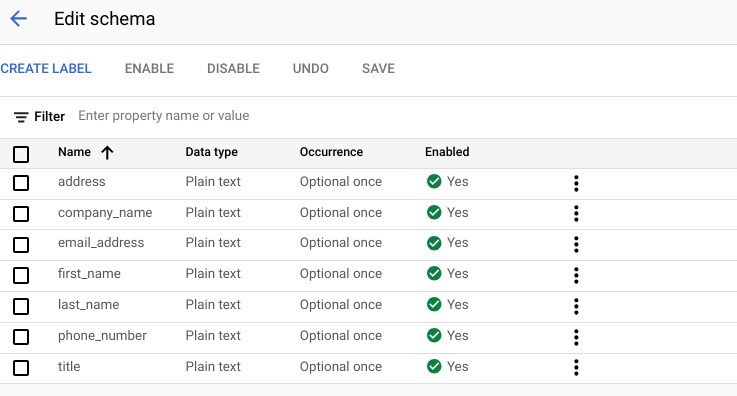

# Purpose and Description

This Document guides to create document schema from key value pairs of form parser output in csv format (The generated schema can be reviewed, updated).
This schema can be used to update for any parser through API.

## Setup the required inputs
* **project_id** : Your Google project id or name
* **formparser_parsed_jsons_path** : GCS storegar path where the form parser output is saved

## CSV schema output

Form parser output in UI

</img>

Retrieved schema from code in the form of csv(‘document_schema.csv’)

</img>

## Updating Schema to another parser

## Setup the inputs
* **project_id** : Your Google project id or name
* **location_processo** : Location of processor
* **processor_id** : to which schema has to be updated
* **updated_schema_csv_path** : csv file modified or reviewed from above step

## Output
The above script adds the schema in the parser as below

</img>
