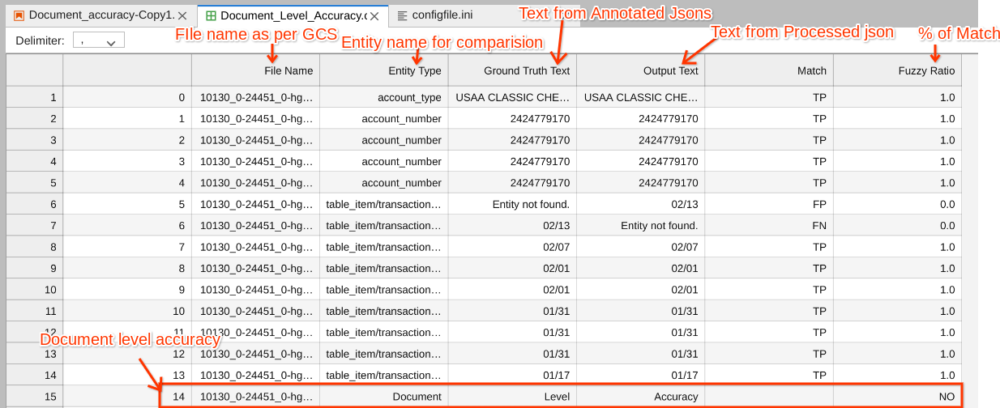

# Objective
This tool uses annotated docs (JSON files) from GCS bucket as input and then runs the same (image) files through the designated version of the processor. Comparison of Annotated json files and processed json files should be provided  in a CSV file with difference and Document level accuracy stats. 

# Input Details
Enter the input details with necessary information as outlined below:

* **project_id**: Provide the project ID of your Google Cloud project.
* **groundtruth_bucket_uri**: Provide the Google Cloud Storage (GCS) path of the annotated JSON files.
* **critical_entities**: Provide a list of critical entities for which you require document level accuracy.
  - Example: `['invoice_id','invoice_date','receiver_name','receiver_address','supplier_name']`
* **processor_id**: Provide the processor ID of your Document AI processor.
* **processor_version_ID**: Provide the processor version ID.
* **Location**: Specify the location (e.g., 'us' or 'eu') where your processor is created.

**NOTE**: If the critical_entities parameter is provided as an empty list then the tool will compare all the entities.

# Output Details
The CSV file should have all the details of mismatch as shown below with Document level accuracy in ‘YES’ or ‘NO’.
In the comparison, if all the entities in annotated jsons and processed json are matching 100%  then the Document level accuracy is shown as YES else NO.

<td></td>
