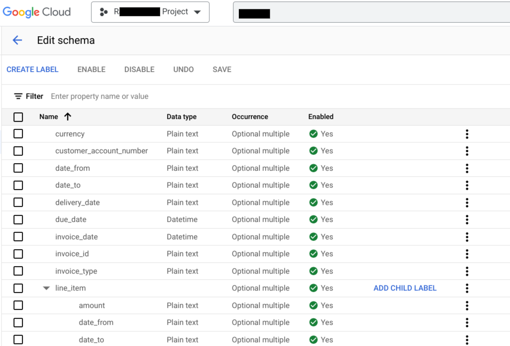
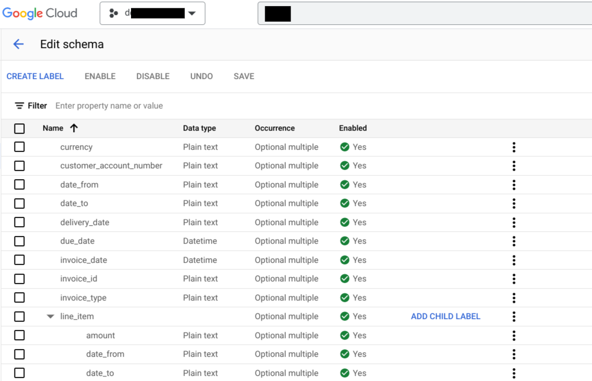

# DocumentAI Migration Schema Between Processors

## Purpose and Description

The code snippet utilizes the Google Cloud Document AI library to migrate a Document AI Dataset schema from one processor to another.
It allows for the migration of schemas within the same Google Cloud project and also between distinct projects.

## Input Details

* **source_processor_id** : This is the Source Processor ID present in source processor details.
* **destination_processor_id** : This is the Destination Processor ID present in destination processor details.
* **source_project_id** : This is the project id of the source project.
* **destination_project_id** : This is the project id of the destination project.

## Output Details

* Source Project Processor Schema :

</img>

* Destination Project Processor Schema :

</img>
