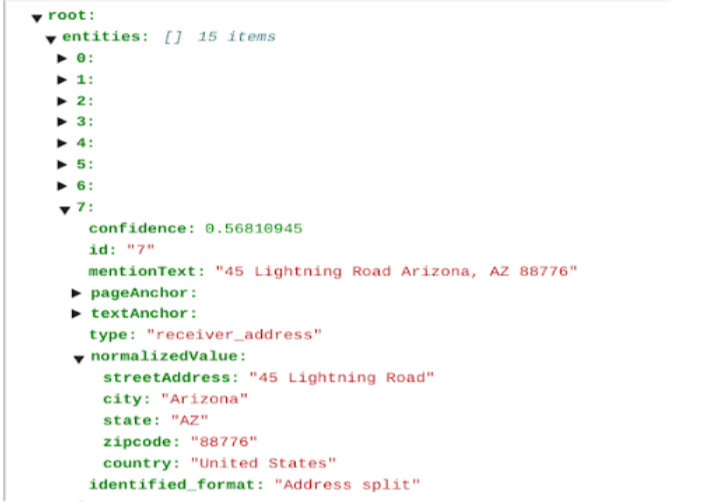

# Purpose and Description
The tool facilitates a more detailed and accurate address parsing process. Detected addresses are broken down into their constituent parts, such as city, country, and ZIP code. The address data is enriched with additional relevant information, enhancing its overall usability.

## Input Details
* **PROJECT_ID** : It contains the project ID of the working project.
* **LOCATION** : It contains the location.
* **GCS_INPUT_PATH** : It contains the input jsons bucket path. 
* **GCS_OUTPUT_PATH** : It contains the output bucket path where the updated jsons after adding the attribute will be stored.
* **ENTITY_NAME** : It contains the names of the entities which the user wants to split. 

## Output Details

The new attribute 'normalizedValue' will be added to each address entity in the newly generated json file.
<table>
    <tr>
        <td>
            <b>Pre-processed data</b>
        </td>
    </tr>
    <tr>
        <td>
            </img>
        </td>
    </tr>
</table>