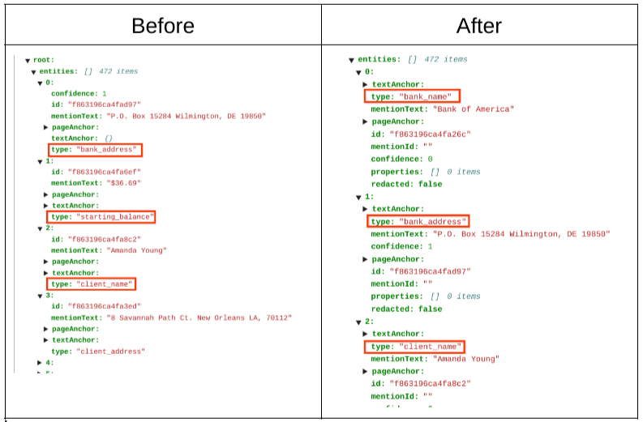

# Purpose and Description
This document provides instructions for sorting the entities from top to bottom as it is in documents from parser output.This document provides the function taking json as input from parser and returns a sorted json.

## Prerequisites

1. Enviroment with .NET framework.
2. Form parser Json files

## Step by Step procedure
### 1. Config file Creation
Run the below code and create a config.ini file for providing input.

### 2. Run the code
1. compile the csharp file by using mcs command
mcs -out:Final_release_csharp.exe Final_release_csharp.cs

2. Finally run the code
mono Final_release_csharp.exe
