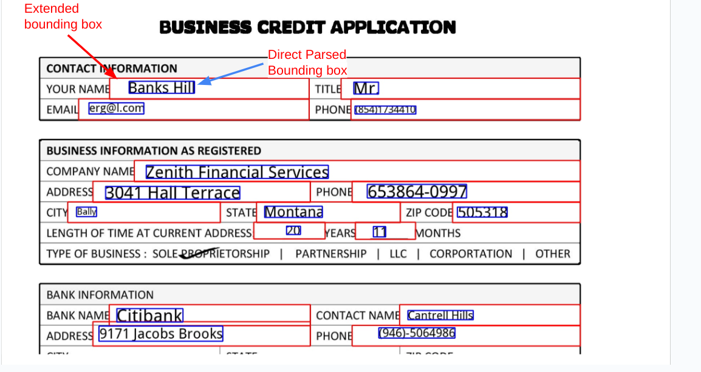

# Purpose and Description

This document guides how to maximize the bounding box of the entities using the parsed jsons.

## Input Details

* **input_path** : GCS Input Path. It should contain DocAI processed output json files.
* **output_path** : GCS Output Path. The updated jsons will be saved in output path.

## Output Details

The bounding boxes of the entities will be enlarged to the nearest text or line.

If we Visualize both the bounding box looks like below image

</img>
