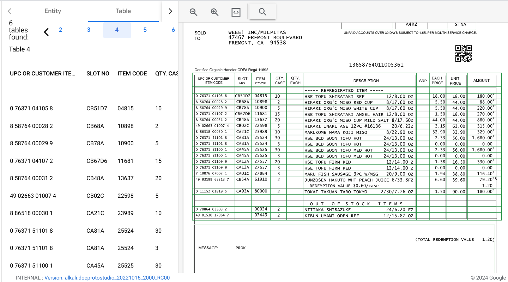
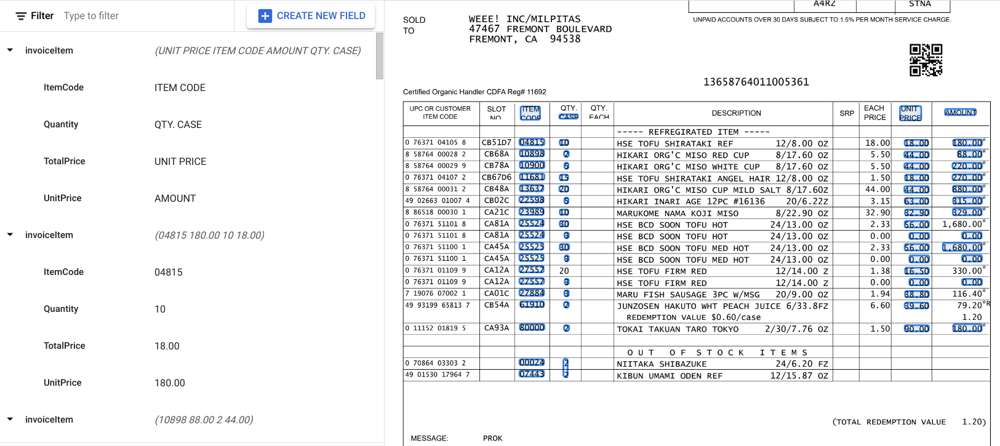

# Purpose and Description

This document provides a step-by-step guide on how to use the Formparser Table to Entity Converter Tool. The tool converts Formparser tables output to entity-annotated JSON files. The user inputs a dictionary of header names and their corresponding entity names, and the tool uses fuzzy matching to map the headers to the entities. The output JSON files can be used to train and visualize entities

## Input Details

user_input = {
    "ItemCode": "item code",
    "Quantity": "QTY CASE",
    "TotalPrice": "Unit Price",
    "UnitPrice": "Amount"
}
* **input_bucket_name** and **output_bucket_name** : variables indicate the Google Cloud Storage bucket name.
* **input_prefix** : It denotes the directory path within the GCS bucket where input JSON files reside.
* **output_prefix** : It marks the directory path within the GCS bucket where processed or output JSON files will be stored.

## Output Details

### Input Form Parser Output Json

### Output Table to line item entity converted Json

The output JSON will contain data extracted from Form parser tables present in the source document,
and this data will be structured as line items.
The extraction and structuring process will be guided by the specifications provided in the user_input dictionary.
The user_input dictionary serves as a blueprint: it maps specific headers (as they appear in the source document)
to corresponding entity names (as they should be represented in the output JSON).
By following these mappings, the script can convert table structure into line items in the resulting JSON.

**Note:**
* Code works for tables with over 7 columns and multiple rows or tables resembling the example shown above.
* When converting tables to line items, the table header becomes part of the line items and gets included in the processed JSON.
* Discrepancies may occur during conversion due to reliance on the form parser table output, resulting in potential merging of columns or rows.

