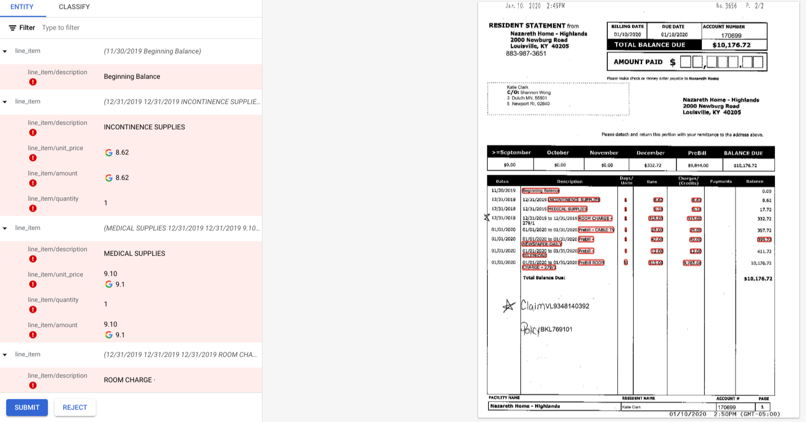

# Purpose and Description

This document is to deal with the CDE trained using invoices and has issues in updating the child items in HITL because of the prefix of child items. The code snippet adds the prefix to child items (similar to invoice parser output) and triggers HITL using invoice parser HITL endpoint.

# Input Details 

* **gcs_input_path**: This contains the storage bucket path of the input files.        
* **gcs_output_path**: This contains the storage bucket path of the output files.                  
* **project_id**: This contains the project ID of the project.               
* **invoice_processor_id**: This is the processor ID of the invoice processor.                  
* **location_processor**: This contains the location/region of the processor.  

# Output Details

The output jsons are similar to the invoice parser jsons(only in terms of line items) and HITL triggered using invoice parser end point

</img>