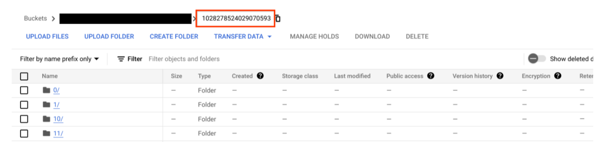

# Purpose and Description

The purpose of this document is to provide instructions and a Python script for evaluating identity document proofing . The script should parse the document with **Identity Document Proofing processor**, and fetch all the entities storing it in a csv file along with the percentage of Total Fraudulent and Non Fraudulent documents.

# Input Details

* **project_id** : Your Google project id or name
* **processor_id** : Processor id with can be found on processor detail tab in gcp UI.
* **input_dir** : The path of the folder containing the image files to be processed, with the bucket name ending with slash(/).              
(Eg : gs://bucket_name/folder_name/)
* **processor_output_dir** : The path of the output folder of the processor with the bucket name and without ending with slash(/).              
(Eg : gs://bucket_name/folder_name)
* **location_processor** : Your Processor location.
* **parser_output_folder_name** : Name of the output folder. You can clearly understand by seeing the below image. 

</img>

This First part of code should generate json files which get stored in a random folder name  generated inside the **processor_output_dir**.

Provide the same random folder name in **parser_output_folder_name** variable.

# Output Details

The script after execution creates a CSV file containing a list of file names with all the fraud detected on the document . The script also generates the percentage of Total Fraudulent and Non Fraudulent documents at the end.

