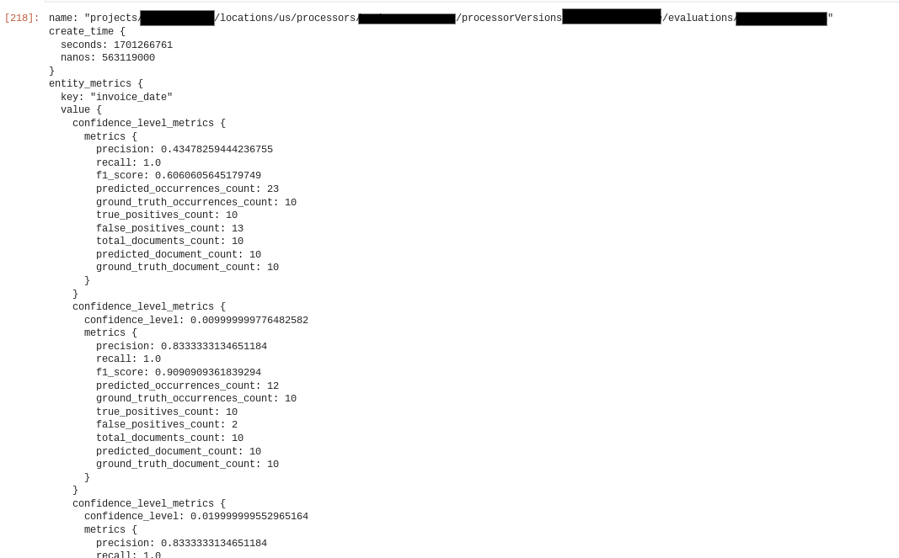

# Purpose and Description

This Document guides to import processors and evaluate the imported processor version using alternate data sets.

* Alternate test sets are the test sets which are used to test the processor version other than which are used while training the processor or in UI
* We get precision, recall and f1 score for set of files from notebook.

# Input Details

## 1. Create a DocAI processor

* **project_number** : Your project number
* **location** : Your project location which the processor has to be created
* **new_processor_display_name** : Name of the processor to be displayed
* **processor_type** : Type of the processor to be created 

## 2. Input for importing processor

* **project_number** : Your project number
* **source_processor_id** : Processor id of processor which has to be imported
* **source_processor_version_id** : Processor version ID which has to be imported
* **source_processor_location** : Location of processor which has to be imported
* **new_processor_id** : Give the processor ID
* **new_processor_location** : Location of the processor to which has to be imported

## 3. Adding a dataset to a processor

* **project_number** : Your project number
* **new_dataset_bucket** : Dataset Storage path location
* **new_processor_location** : Location of the processor to which has to be imported
* **new_processor_id** : Give the processor ID
* **new_processor_version_id** : Processor version ID for which dataset has to be added

# Output Details 

Sample Evaluation Result

</img>