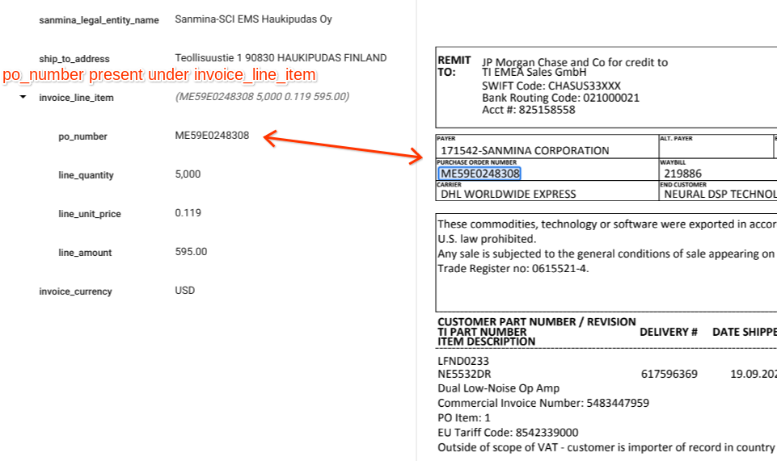
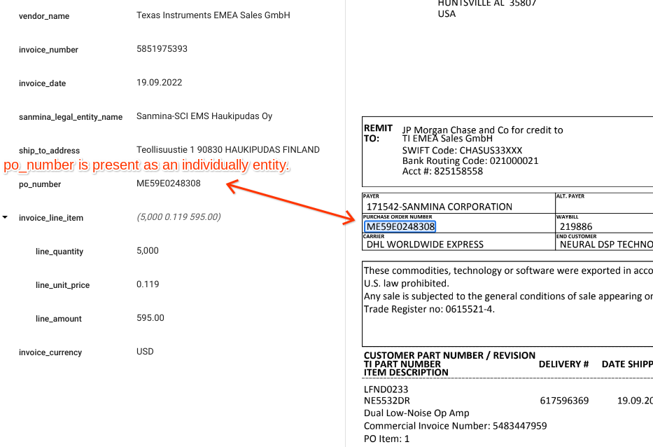

# Objective

This tool uses the exported labeled dataset from the processor and removes the child_item “po_number” from “invoice_line_item” , adds it as an individual entity and saves back the json to google storage.

## Input Details
**input_bucket_path:** GCS URI of the folder, where the dataset is exported from the processor.

**output_bucket_path:** GCS URI of the folder, where the updated json should be saved.

**Note:** The output folder maintain the folder structure same as the input_bucket_path , please refer below.

## Output Details
We should get the updated json where “po_number” is removed from invoice_line_item, and it is present as an independent entity.

### Sample Input
</img>  

### Sample Output
</img>