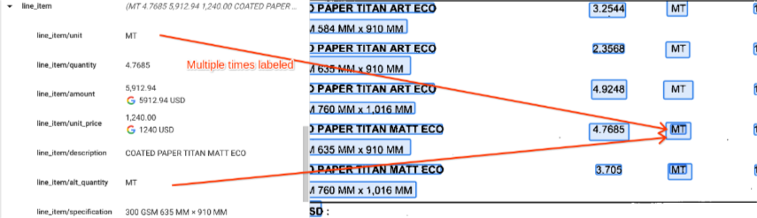
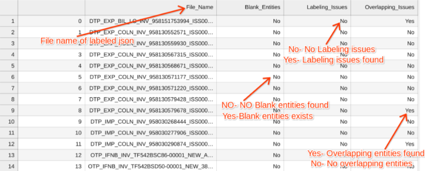
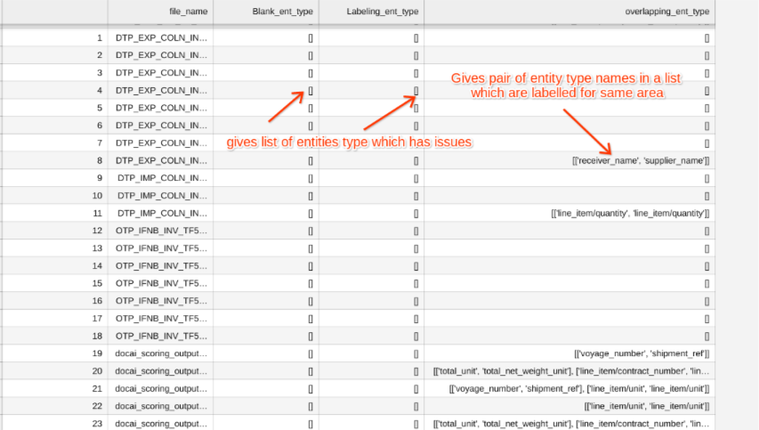
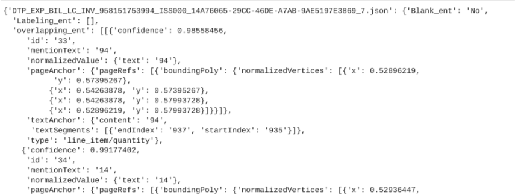

# Purpose and Description

This tool uses labeled json files as an input and gives whether there are any labeling issues like blank entities, entities which have text anchor or page anchor issues and overlapping of entities as output in a csv and dictionary format for further use.

# Input Details

* **GCS_INPUT_PATH**: GCS folder path of labelled JSON files

# Output Details
The output is in 2 CSV files and a dictionary. 

In the CSV files , the columns are as below  
**File_Name**: File name of the labeled json in GCP folder  
**Blank_Entities**: The entities which are labeled blank or which doesn't have anything in the mentionText of the entity  
**Yes**- Denotes there are Blank entities  
**No** - No Blank entities found in the json  

### Labeling issues:

The entities which have issues in Text anchors or Page anchors are treated as labeling issues because of which you cannot convert into proto format.  
**Yes** - denotes there are few entities which have labeling issues  
**No** - denotes no labeling issues  

### Overlapping issues:
The entities where it is labeled more than once with same or different entity type like below  
  

### 1. labeling_issues.csv
  

### 2. labeling_issues_with_entity_type.csv
This CSV file is the same as **labeling_issues.csv** but with a list of entity types which have issues.  

For Blank_entities and Labeling issues, the entity type needs to be provided in a list which have issues  

But for overlapping issues , it gives the entity name in the nested list where each list has 2 values which are labeled in the same area.  

  

**file_wise_entities** is a dictionary where it has all the entity details which issues and can be deleted if needed from the json.  
  

