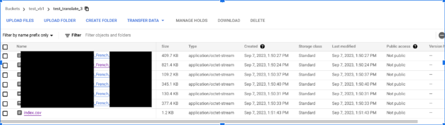
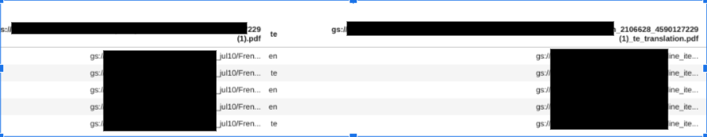
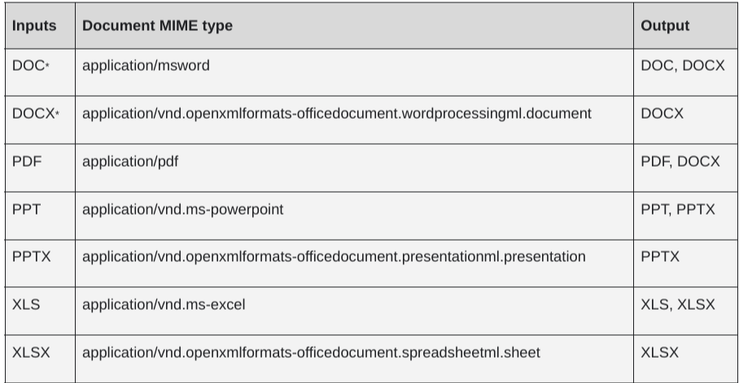

# Purpose and Description

This document guides you to use the translation API for detecting the language of the document and also to translate the document to the desired language.

# Input Details
* **project_id**: GCP project Id
* **location**: The location of the project.
* **path**: GCS uri of JSON file like `'gs://xxxx/xxxx/xxxxx.json'`
* **gcs_input_path**: GCS uri of PDF like `'gs://xxxx/xxxx/xxx/xx.pdf'`
* **gcs_output_path**: GCS output uri prefix like `'gs://xxxxx/xxx/'`

# Output Details
### 1. Detecting language from Doc AI parsed json( OCR text)
```python
languages {
  language_code: "de"
  confidence: 1.0
}
```

### 2. Detecting language and Translating the document (Single document)
Response: Detected Language Code - fr
Translated document will also be saved in the gcs output path  and file name (format) saved will be as per [doc](https://cloud.google.com/python/docs/reference/translate/latest/google.cloud.translate_v3beta1.types.DocumentOutputConfig)

### 3. Detecting language and Translating the documents ( Batch process)

The target language code can be multiple languages and the output translated documents are saved in the output path given and also with a ‘index.csv’ file which has file path and names from source and destination as well .




#### Supported Languages and File types [Link](https://cloud.google.com/translate/docs/advanced/translate-documents)


#### Supported Languages  [Link](https://cloud.google.com/translate/docs/advanced/discovering-supported-languages-v3)

run `get_supported_languages` to see output data - to get all the supported languages in the project  
run `get_supported_languages_with_target` to see output - to get all the supported languages with target language