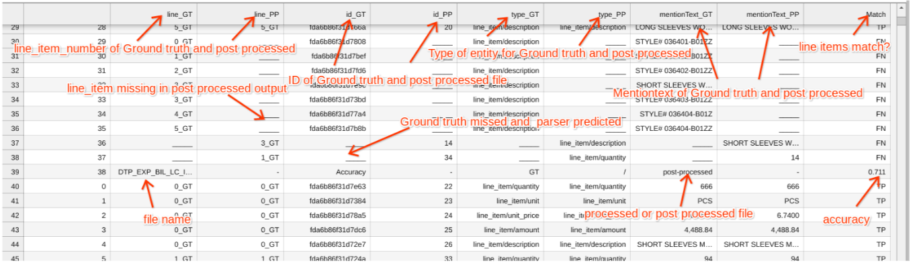

# Overview

This script is designed to compare JSON schemas using Google's Document AI and other processing tools. It includes functionality for fuzzy matching and schema comparison.

# Input Details
* **project_id** : Give your GCP Project ID
* **gt_jsons_URI** : It is GCS path which contains ground-truth JSON files
* **parsed_jsons_URI** : It is GCS path which contains document-processed JSON results
* **post_processed_jsons_URI** : It is GCS path which contains document-processed JSON results

**NOTE**:
* Here all GCS paths should ends-with trailing-slash(`/`)
* The file names have to be same in all the folders which contains Ground truth, parsed and post processed jsons

# Output Details
Upon successfull execution of code, you can able to see three generated CSV files(`GT_line.csv`, `post_line.csv` 7 `compare_all.csv`). Please refer those csv files for better-understanding.

This gives the CSV file which shows the difference between Ground truth, parsed files and post processed files
</img>

**GT**- represents ground truth 
**PP**-Post processed or Processed
**line-GT** and **line PP** - are the specific line item numbers given to compare whether they are assigned to same line items

**Match** - Whether the line items are assigned correctly? 
If Matched - **TP**- True positive
Not matched - **FP**- False positive
If Ground truth or Processed or post processed child item is missing - **FN** - false negative is considered