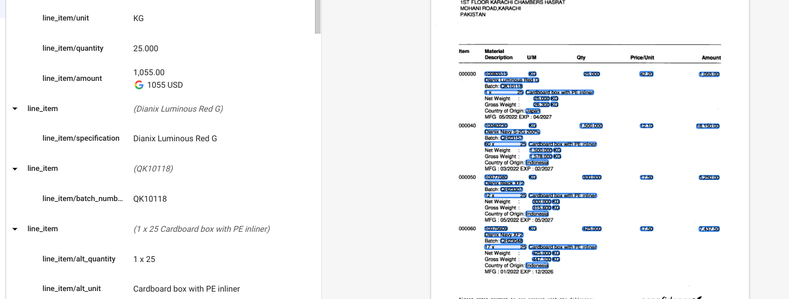
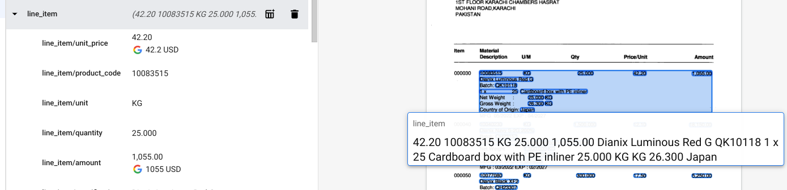

# Purpose and Description

This tool takes in parsed json (prediction result) files and a list of child entities which occurs only once (per line item) in the schema of line_items to better group the child entities into correct line_items(parents).

# Input Details
* **Gcs_input_path** : GCS folder path of parsed results JSON-files
* **project_id** : GCP Project Id
* **Gcs_output_path** : GCS folder path to store updated JSON's
* **unique_entities** : It is a list of unique line item entites
* **Desc_merge_update** : It is eith true or false, if you want to combine description within the line item give `yes`, else `No`
* **line_item_across_pages** : If you want to group line items across pages give `Yes` otherwise `No`

# Output Details
Groups the child items of line_item into right parent (line_item)
### Before post processing the parsed json has multiple line items without proper grouping

</img>

### After post processing, properly grouped line items

</img>