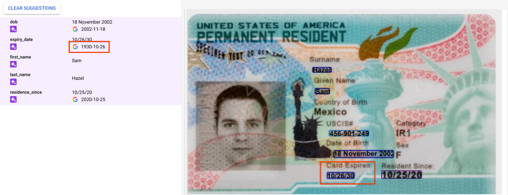
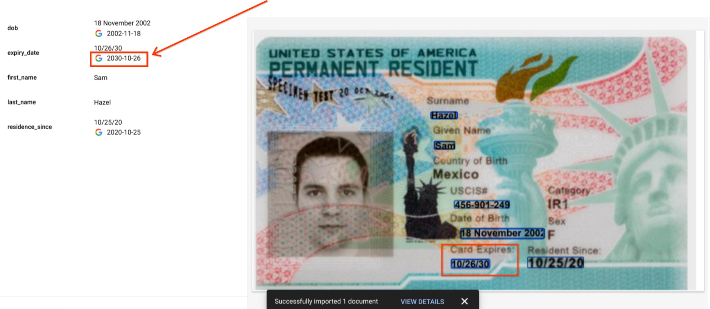

# Purpose and Description
This is a post processing tool to normalize year in date related entities from 19xx to 20xx. Document AI processors will give a normalized_value attribute for date entities in Document Object and sometimes this normalized value for year will be inferred as 19xx instead of 20xx.

## Input Details

* **INPUT_GCS_PATH** : It is input GCS folder path which contains DocumentAI processor JSON results
* **OUTPUT_GCS_PATH** : It is a GCS folder path to store post-processing results

## Output Details

Refer below images for preprocessed and postprocessed results
<table>
    <tr>
        <td>
            <b>Pre-processed data</b>
        </td>
        <td>
            <b>Post-processed data</b>
        </td>
    </tr>
    <tr>
        <td>
            
        </td>
        <td>
            
        </td>
    </tr>
</table>
