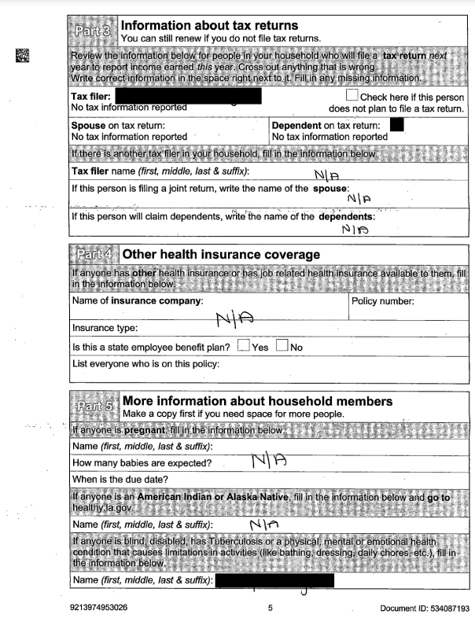
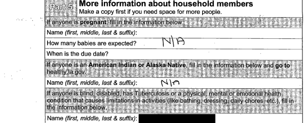

# Purpose and Description

This tool is designed to segment PDF documents into distinct sections based on the header coordinates obtained from the Document OCR processor.
It then saves the segmented outputs as individual images, each named after the corresponding section.
Additionally, the tool offers the option to specify which sections need to be split, allowing for selective processing.

## Input Details

* **bucket_name**: This variable should contain the name of the Google Cloud Storage bucket.

* **input_folder**: This variable should contain the path to the input folder which contains the Document OCR Output Json of the PDF files which need to be processed.

* **output_folder**: This variable should contain the path to the output folder where all the splitted images will be stored.

* **search_strings_parts**: This dictionary is designed with unique strings that act as identifiers. In the provided example, each string represents the title of a section on the page. These unique titles serve as delimiters, enabling the straightforward identification and separation of different sections.

* **selected_parts**: This is a list of selected parts to be selected. Specify the part names within the list.

To select all parts, you can uncomment the line selected_parts = None and comment out the previous line with the list of parts.

## Output Details

The PDF will be divided according to your specified input, and each section will be stored as a separate image in the output directory, following the naming pattern <file_name>_part_*.jpeg.

## **Input PDF**

## **Output Splitted Images**

## **Part 3**

## **Part 4**

## **Part 5**

