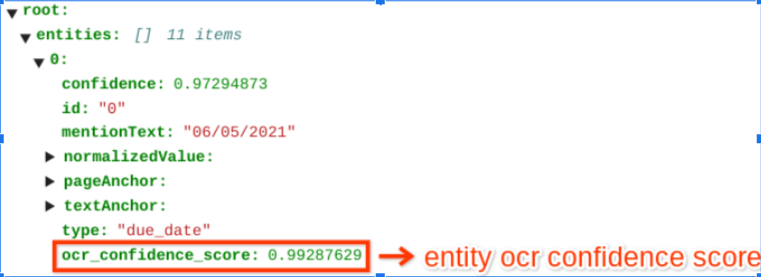

## Purpose and Description

The objective of this tool is to get the confidence score of individual tokens and then compare it with the text segments of the entities. By doing this, the tool aims to identify the minimum OCR confidence among these comparisons. 
The tool associates the lowest confidence value with the respective entity. This resulting confidence value is stored as the "ocr_confidence_score." Every entity, including both parent and child entities, it possess its own OCR confidence score.

# Input Details
 * **source_bucket_name**: GCS bucket name which contians input files
 * **source_folder_path**: GCS folder containing jsons
 * **destination_bucket_name**: GCS bucket name which stores output files
 * **destination_folder_path**: GCS folder to store processed json files
 
# Output Details

 

**NOTE**: Please note that you can change the default confidence score generated by the processor by changing the "ocr_confidence_score" to "confidence".
