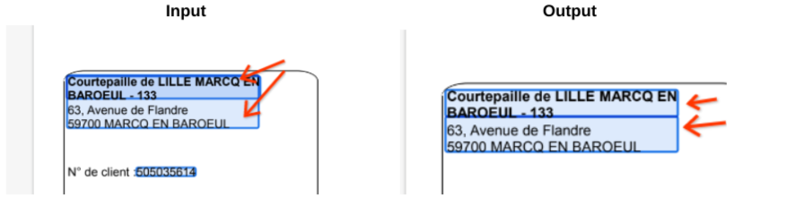

# DocAI Splitting Overlapping Entities

* Author: docai-incubator@google.com

## Disclaimer

This tool is not supported by the Google engineering team or product team. It is provided and supported on a best-effort basis by the DocAI Incubator Team. No guarantees of performance are implied.

## Purpose and Description
This tool uses exported labeled json to separate a pair of entities that are overlapped due to labeling into two individual entities. 

## Prerequisites

1. Vertex AI Notebook
2. Parsed json files in GCS Folder.
3. Output folder to upload the updated json files.

## Step by Step procedure 

### 1. Input details
input_path : GCS Path for input json files 
output_path: GCS Path for output json files 
list_of_pair_of_entities: [('customer_account_name','ship_to_address')]

<i><b>Note:</b> List of pairs of entities that need to be splitted. Also, the entity name should be mentioned like this (small_entity,large_entity)</i>

### 2. OutputThe output json after execution of the code have individual entities.

