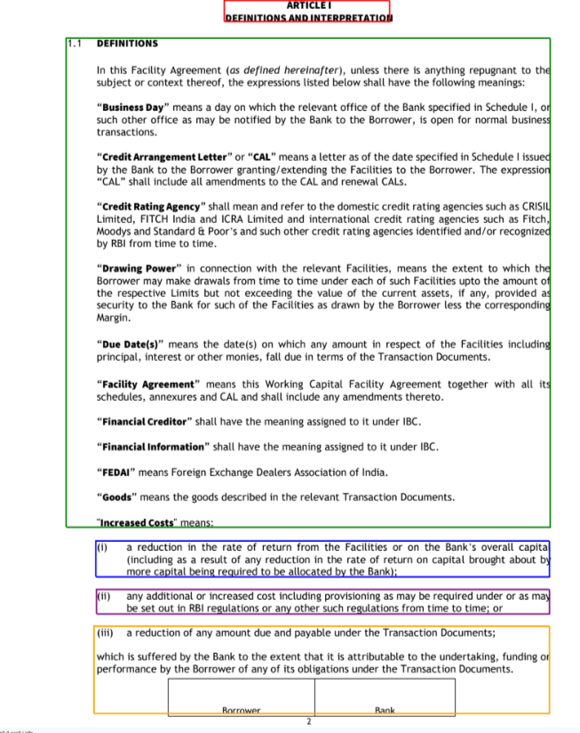
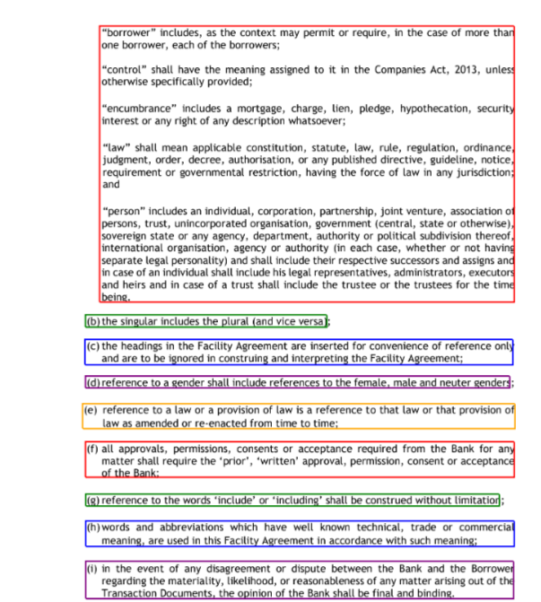

# Purpose and Description

This document provides instructions for correcting merged paragraphs identified during the OCR process. The separation is achieved based on specific characters such as (i), (ii), (iii), (a), (b), and so on.

## Input Details

* **input_uri** : This contains the storage bucket path of the input files.  
* **output_bucket_name** : Your output bucket name.
* **base_file_path** : Base path within the bucket for storing output.

## Output Details

The fixed documents are saved in the output bucket which you have provided in the script with the same folder structure in input URI.

</img>
</img>
