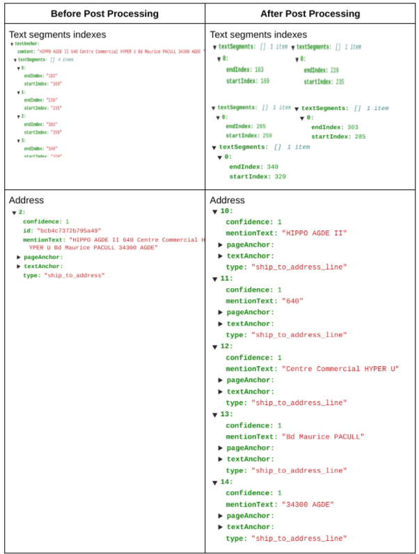
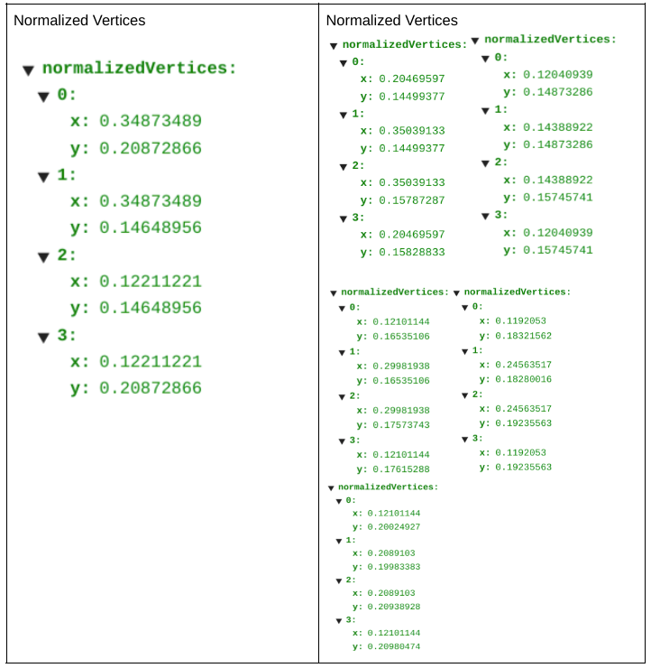
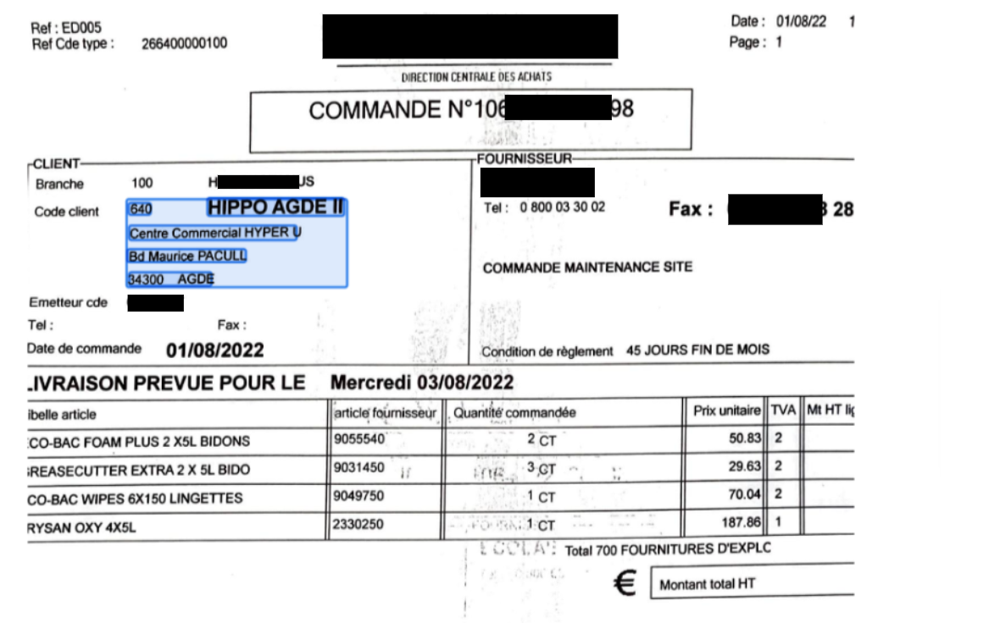

# Purpose and Objective
This tool is a post processing script which splits the combined address into multiple addresses. In the parsed sample json file it is observed that there exists an address field `shipt_to_address` and it needs to be split into multiple `ship_to_address_line` address entities . This can be achieved by splitting the address lines into multiple address elements in the json. The json Entity keys Normalized Vertices and Text Segments indexes are to be updated properly with correct values when the address line is splitted.

# Input Details
* **input_path**: GCS Storage name. It should contain DocAI processed output json files. This bucket is used for processing input files and saving output files in the folders.
* **output_path**: GCS URI of the folder, where the dataset is exported from the processor.

**NOTE**: GCS path should always ends-with trailing-slash (`/`)

# Output Details
The post processed json field can be found in the storage path provided by the user during the script execution that is **output_bucket_path**. 

Upon running the post processing script against input data. The resultant output json data is obtained. The following table highlights the differences for following elements in the json document.
* Address
* Normalized Vertices
* Text Segment indexes

</img>
</img>

When the output json document is imported into the processor, it is observed that the address is now a multiple entity and has the bounding boxes as shown:
</img>