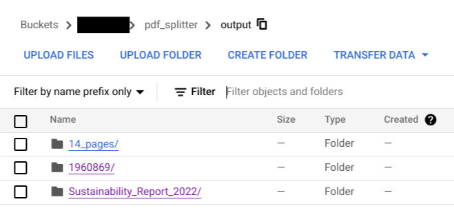

# Objective

The objective of this notebook is to provide python script which helps to split large pdf-file into smaller-chunk-files based on chunk size provided by user(number of pages per each chunk-pdf).

# Input Details

* **PROJECT_ID**: Provide GCP Project Id
* **BUCKET_NAME**: Provide GCS bucket name 
* **INPUT_FOLDER_PATH**: Provide GCS folderpath which contains input PDF files, _gcs uri without bucket name_
* **OUTPUT_FOLDER_PATH**: Provide GCS folderpath to store chunked-PDF files, _gcs uri without bucket name_
* **CHUNK_SIZE**: Provide number of pages you are required for each pdf-chunk.

# Output Details

If you check OUTPUT_FOLDER_PATH, you can see all large pdf files chunked to corresponding folders.

 
