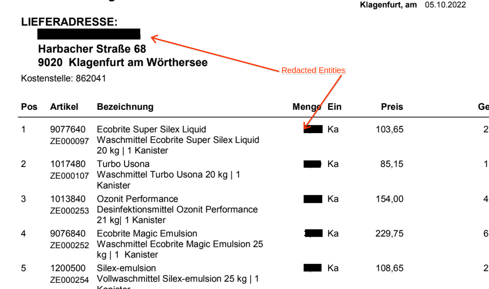

# Purpose and Description

This tool uses parsed json files and a list of entities which have PII data and converts the json into PDF after redacting the entities provided.

## Input Details

* In the list of entities, provide the entities which have to be redacted. If there is a child item to be redacted please specify as parent item type/child item type  even though the child item does not have the parent name in type. Example: line_item/amount

* **GCS_input_path** : GCS Input Path. It should contain DocAI processed output json files.
* **GCS_output_path** : GCS Output Path. The updated synthesized data in the PDF.
* **PII_Entities** : Entities for which the mentiontext has to be redacted and replaced with synthetic data given in the excel

## Output Details

* The New PDF documents with synthesized data will be saved in GCS_output_path
* Entities will be redacted and PDF will be saved in the GCS output folder provided.

</img>
