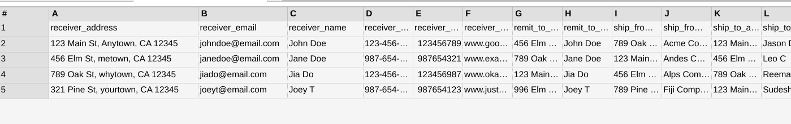

# Purpose and Description

This document guides to replace the PII data with synthetic data using parsed jsons and entity types to be redacted as input and gives a pdf document with synthetic data.

# Input details

* **GCS_input_path** : GCS Input Path. It should contain DocAI processed output json files. 
* **GCS_output_path** : GCS Output Path. The updated synthesized data in the pdf. 
* **project_id** : It should contains the project id of your current project.
* **PII_Entities** : Entities for which the mentiontext has to be redacted and replaced with synthetic data given in the excel
* **Redact_text** : Redacting text with text as input
* **Synthetic_data_path** : xlsx file which has synthetic data , column names matching entity type and corresponding values having synthetic data like below.
* **Sheet_name** : Sheet name where the synthetic data is present 
* **Synthetic data will be chosen randomly.

</img>

# Output details

The New pdf documents with synthesized data will be saved in GCS_output_path