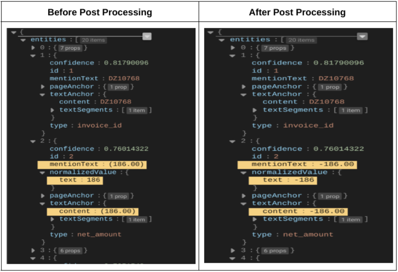
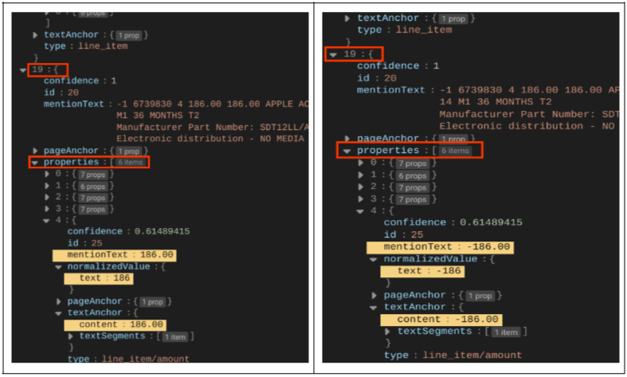
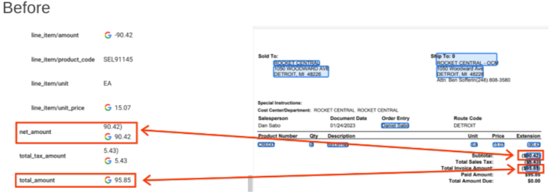
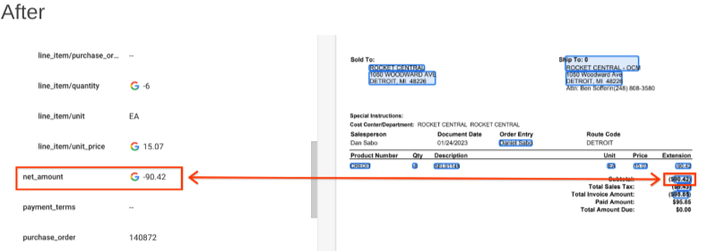

# Purpose and Description

If you require a post processing script which corrects the negative values especially the amount. These values are enclosed within a round brackets,for example ‘(123.99)’, which indicates a negative value provided by the OCR. For every documents such entities are to identified, their round brackets are removed and prefixed with a minus ‘-’ symbol for every occurences using a python script.

## Input Details

**input_path**: GCS Storage name. It is DocAI processed output json files. This bucket is used for processing input files and saving output files in the folders.
**output_path**: GCS URI of the folder, where the dataset is exported from the processor.
**types**:Input the name of the entities type for which the correction should happen in the list

## Output Details

The post processed json field can be found in the storage path provided by the user during the script execution that is output_bucket_path.  

<b>Comparison Between Input and Output File</b>  
<i><h4>Post processing results<h4><i> 
The following table shows the result of correction of entities having negative values from a sample json document.
The key:value pairs which are to be processed are as shown.There are two cases in the example. One is presence of the negative value in the entities key and other is the example of presence of negative value in the properties key belonging to the entities key.The script works by correcting both cases.

<i><h4>Processor: Before and After images</h4></i> 
The differences observed before and after post-processing json docs and importing into Document AI processor
<table style="float:left">
<tr style="border: 1px solid black"><td>
</td></tr>
<tr style="border: 1px solid black"><td>
</td></tr>
</table>