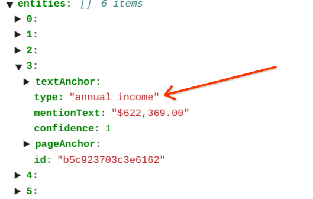
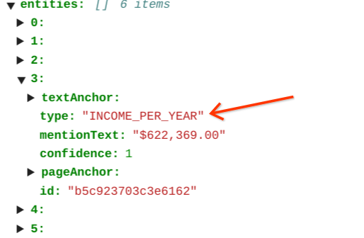
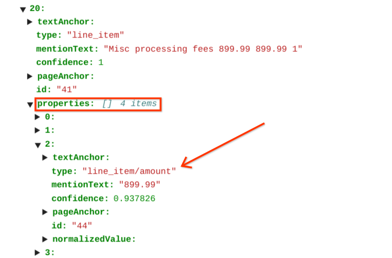
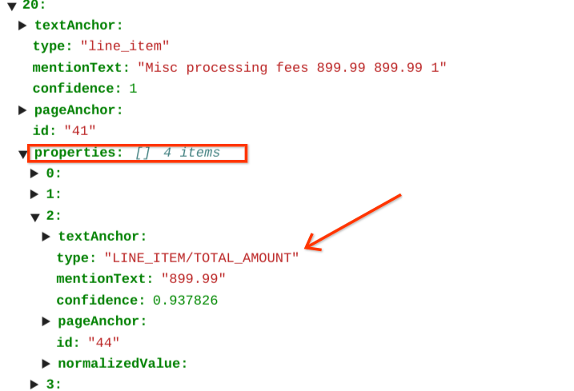

# Purpose and Description

This tool is used to rename specific entity type(`documentai.Document.Entity.type_`) of Document Proto Object to new entity type based on provided mappings(`RENAME_MAPPINGS - dictionary`)
<table>
    <td><b>Entity Type Text Before Processing</b></td><td></td>
    <td><b>Entity Type Text After Processing</b></td><td></td>
</table>

# Input Details
* **INPUT_GCS_PATH**:  It is an input GCS folder path which contains DocumentAI processor JSON results.
* **OUTPUT_GCS_PATH** : It is a GCS folder path to store post-processing results.
* **RENAME_MAPPINGS**: It is a dictionary object which contains existing entity type as key and new entity type as value. For eg {**"old_entity_type"**: `"new_entity_type"`, ..}

# Output Details

After successfull running of provided python script against DocumentAI Processor JSON results folder. You can observe entity type changes taking place based on the provided  `RENAME_MAPPINGS` dictionary. Refer below sample input-output images.

<table>
    <tr>
        <td><h3><b>Pre-processing</b></h3></td>
        <td><h3><b>Post-processing</b></h3></td>
    </tr>
<tr>
<td></td>
<td></td>
</tr>
<tr>
<td></td>
<td></td>
</tr>
</table>