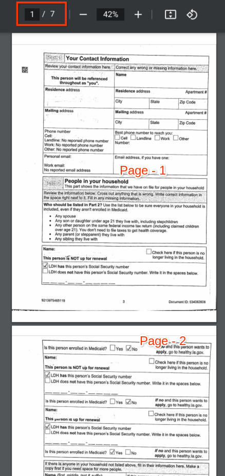
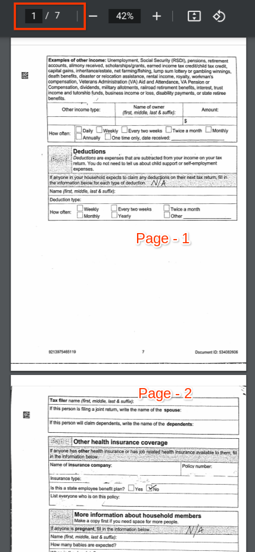

# Objective
This tool is to reorder the pages of the provided pdf-pages based on the unique strings provided as list of strings(i.e, Logical Identifiers) that appear in a logical order. Based on the provided logical-order of strings pages are shuffled in output file.

# Input Details
* **PROJECT_ID**: Provide GCP Project id
* **LOCATION**: Provide processor location `us` or `eu`
* **PROCESSOR_ID**: Provide DocumentAI processor id
* **PROCESSOR_VERSION_ID**: Provide DocumentAI processor version id
* **GCS_INPUT_FOLDER**: Provide GCS folder name of the input PDF's which needs to be processed.
* **GCS_OUTPUT_FOLDER**: Provide GCS folder name to store processed results as PDF's.
    * **NOTE**: Both input and output bucket are different, If both buckets same then this tool will overwrite input sample with output data.
* **UNIQUE_STRINGS**: Provide list of unique strings in logical-order, whose order is used to sort the pdf-pages. Output pages order is based on the index-order of this data only.
    * **NOTE**: Refer list of string data in notebook

# Output Details
After running script, pages were shuffled in pdf based on the logical-order of provided `UNIQUE_STRINGS`

<table>
<tr>
<td> Pre-processing</td>
<td> Post-processing</td>
</tr>
<tr>
<td></td>
<td></td>
</tr>
</table>