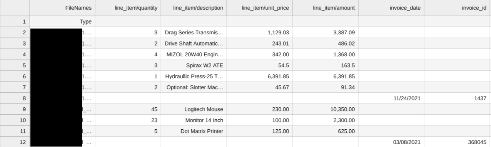

# Purpose and Description
This tool helps in annotating or labeling the entities in the document based on the ocr text tokens. The notebook script expects the input file containing the name of entities in tabular format. And the first row is the header representing the entities that need to be labeled in every document. The script calls the processor and parses each of these input documents. The parsed document is then annotated if input entities are present in the document based on the OCR text tokens. The result is an output json file with updated entities and exported into a storage bucket path. This result json files can be imported into a processor to further check the annotations are existing as per the input file which was provided to the script prior the execution.

# Input Details
* **PROJECT_ID** : GCP project Id
* **LOCATION** : Location of DocumentAI processor, either `us` or `eu`
* **PROCESSOR_ID** : DocumentAI processor Id
* **PROCESSOR_VERSION** : DocumentAI processor verrsion Id(eg- pretrained-invoice-v2.0-2023-12-06)
* **INPUT_BUCKET** : It is input GCS folder path which contains pdf files
* **OUTPUT_BUCKET** : It is a GCS folder path to store post-processing results
* **READ_SCHEMA_FILENAME** : It is a csv file contains entities(type & mention_text) data, which are needed to be annotated. In csv, Column-1(FileNames) contains file names , Column-2(entity_type) contains data to be annotated, Column-3 and its following fields should follow same field-schema as Column-2. In otherwords it is a schema file containing a tabular data with header row as name of the entities that needs to be identified and annotated in the document and the following rows are for each file whose values needs to be extracted.   

    
 
# Output Details
As we can observe, data mentioned in csv is annotated in DocAI proto results
</img>
